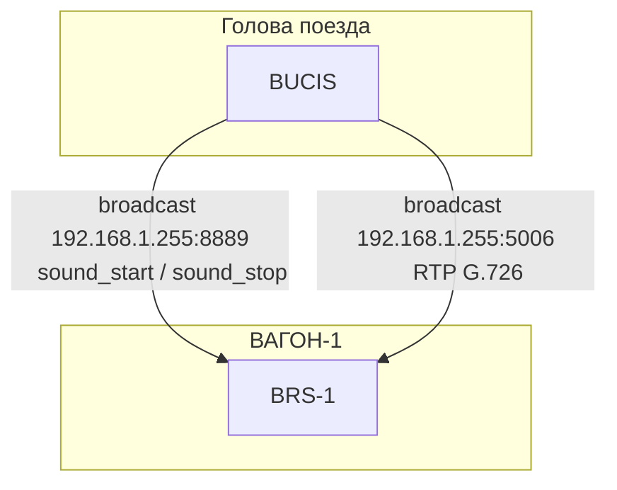
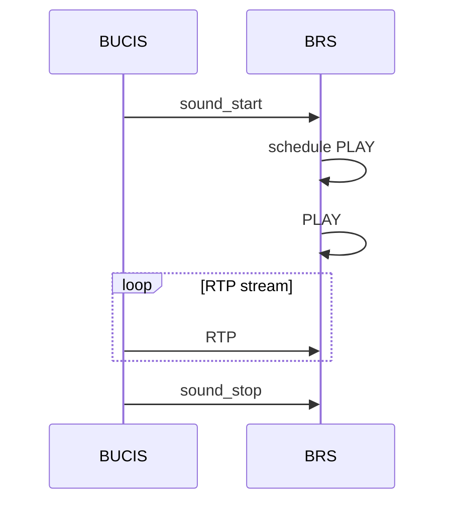

## AnnouncerSimulator

**Симулятор синхронных аудиообъявлений**

Проект имитирует работу аудиоподсистемы системы «Сармат» с помощью UDP broadcast.

Проект моделирует **синхронный старт воспроизведения** на нескольких узлах в одной подсети через **UDP broadcast** с разделением на:

- **control-plane**: управляющие UDP-команды `sound_start` / `sound_stop`
- **media-plane**: RTP/UDP поток с аудио (G.726 32 kbit/s)

---

## 1. Архитектура

### Принцип разделения

- **BUCIS** — инициатор. Читает MP3, декодирует его в PCM (Pulse-code modulation), кодирует в G.726 и рассылает RTP-пакеты. Перед стартом RTP отправляет `sound_start` по broadcast с таймстампом \(t0\) — чтобы получатели синхронно начали приём в заданный момент.
- **BRS** — получатель. По команде `sound_start` планирует старт медиаприёмника на момент \(t0\). Ровно в \(t0\) открывает UDP-сокет для media-plane и принимает RTP-пакеты, декодирует G.726 в PCM (PCM отбрасывается — ALSA недоступен), собирает метрики: число принятых пакетов, потери, jitter.

### Два канала

| Канал         | Порт | Протокол                          | Направление | Содержание                  |
| ------------- | ---- | --------------------------------- | ----------- | --------------------------- |
| Control-plane | 8889 | UDP broadcast                     | BUCIS → BRS | `sound_start`, `sound_stop` |
| Media-plane   | 5006 | RTP/UDP broadcast `192.168.1.255` | BUCIS → BRS | G.726 32 kbit/s             |

### Топология

---

## 2. Роли узлов

- **`bucis`** (инициатор)
  - читает MP3 (путь задаётся через `AUDIO_FILE` / `--audio-file`)
  - декодирует в PCM, ресемплит в 8 kHz mono
  - кодирует PCM в **G.726** 32 kbit/s
  - отправляет `sound_start` с таймстампом \(t0 = now + offset\) по broadcast (1 раз на сессию)
  - ровно в \(t0\) начинает слать **RTP** (20 мс фреймы) по broadcast на media-порт
  - по завершении отправляет `sound_stop`

- **`brs`** (получатель)
  - слушает broadcast control-plane
  - по `sound_start` планирует старт приёма на момент \(t0\)
  - принимает RTP, декодирует G.726 → PCM (PCM отбрасывается)
  - собирает статистику сессии: `received / expected / lost / jitter_ms`
  - по `sound_stop` останавливает приём и печатает итоговые метрики
  - если RTP не приходит \(\approx 1\) секунду во время активной сессии — сессия автоматически завершается по таймауту и печатаются метрики

### Два канала (порты/протоколы)

| Канал         |   Порт | Протокол          | Направление   | Содержимое                                                                          |
| ------------- | -----: | ----------------- | ------------- | ----------------------------------------------------------------------------------- |
| Control-plane | `8889` | UDP broadcast     | `bucis → brs` | `sound_start`, `sound_stop`                                                         |
| Media-plane   | `5006` | RTP/UDP broadcast | `bucis → brs` | G.726 32 kbit/s (PT=2 по RFC 3551; при необходимости PT 96–127 через `RTP_G726_PT`) |

---

## 3. Протокол

### Control-plane (UDP, порт `8889`)

- **`sound_start <тип>;<timestamp_ms>;<session_id>;`**
  - `тип` — `1` (воспроизведение файла) или `2` (микрофон/громкая связь)
  - `timestamp_ms` — Unix timestamp в миллисекундах (когда начинать приём/передачу)
  - `session_id` — опционально (в симуляторе генерируется как 8 hex-символов)
  - в симуляторе `bucis` отправляет `тип=1`
- **`sound_stop`**
  - остановка текущей сессии (аргументы, если есть, будут проигнорированы приёмником)

### Media-plane (RTP/UDP, порт `5006`)

RTP (v2) с параметрами:

- **Sample rate**: 8000 Hz
- **Frame**: 20 ms
- **Samples per frame**: 160
- **Payload type**: `2` (статический PT по RFC 3551 для G.726 32 kbit/s при 8 kHz; для совместимости с динамическими профилями можно задать `96`–`127` через `RTP_G726_PT`)

Полезная нагрузка — **ITU-T G.726** 32 kbit/s (4 бита на сэмпл), в том же формате октетов, что и ранее в симуляторе (по два сэмпла в байте, младший ниббл первый).

Один RTP-пакет соответствует 20 мс аудио:
160 сэмплов × 4 бита = **80 байт payload**.

---

## 4. Поток выполнения

**Синхронизация:** BRS может получить `sound_start` в разное время, но все активируют медиаприёмник ровно в `t0` — за счёт единого timestamp в команде.

---

## 5. Конфигурация

### Переменные окружения

Общие (для `bucis` и `brs`):

- **`CONTROL_ADDR`**: broadcast-адрес подсети (например `192.168.1.255`)
  - для `bucis`: **обязателен**
  - для `brs`: если не задан, используется **`192.168.1.255`** (автоопределения broadcast-адреса подсети сейчас нет)
- **`RTP_G726_PT`**: RTP payload type для G.726, default `2`; допустимо также `96`–`127` (динамический диапазон)
- **`CONTROL_PORT`**: UDP порт control-plane
  - для `bucis`: **обязателен**
  - для `brs`: default `8889`
- **`MEDIA_PORT`**: UDP порт media-plane (RTP)
  - для `bucis`: **обязателен**
  - для `brs`: default `5006`

Для `bucis`:

- **`CONTROL_OFFSET_MS`** (или `OFFSET_MS`): задержка до \(t0\) в мс (**обязательна**, должно быть `> 0`)
- **`CONTROL_SEND_INTERVAL_MS`** (или `SEND_INTERVAL_MS`): пауза между сессиями в мс (**обязательна**, должно быть `> 0`)
- **`AUDIO_FILE`**: путь к MP3 (**обязателен**)

Для `brs`:

- **`BRS_NAME`**: имя узла в логах, default `brs`
- **`METRICS_ADDR`**: адрес назначения метрик, default = `CONTROL_ADDR`
- **`METRICS_LISTEN_PORT`**: UDP порт для приёма команды `get_metrics`, default `8892`
- **`METRICS_SEND_PORT`**: UDP порт назначения для отправки метрик, default `8892`
- **`METRICS_REPLY_PORT`**: UDP порт ответа на `get_metrics`, default `8881`
