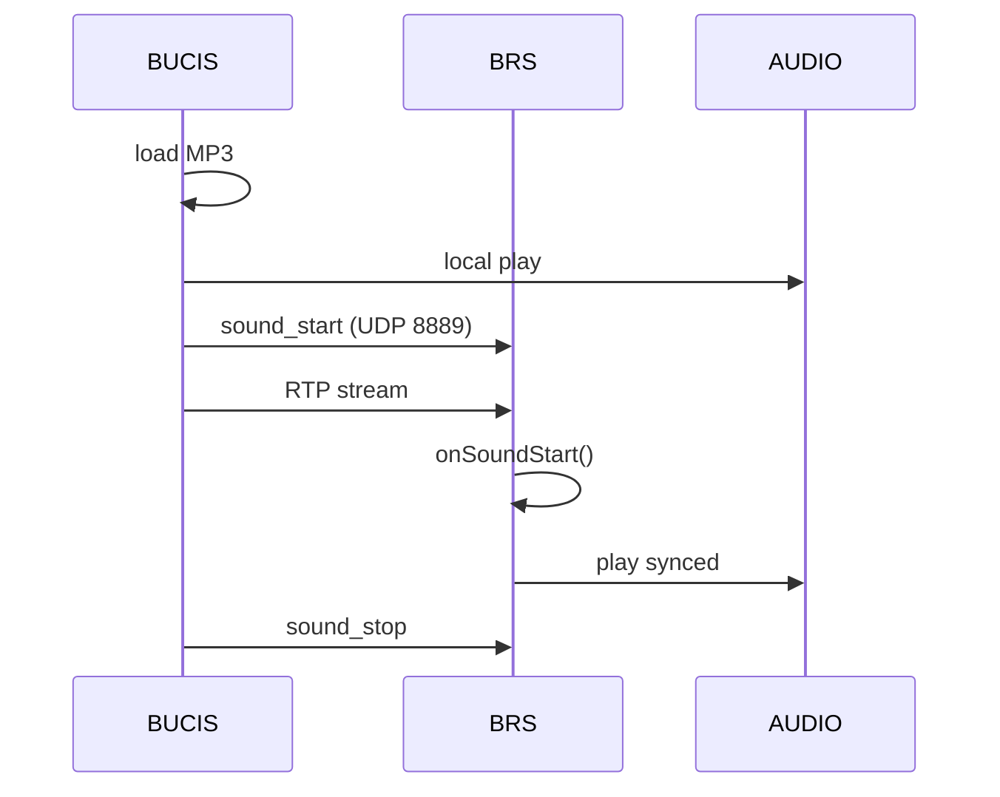

# Полный путь объявления «Осторожно, двери закрываются»

## 0. Тип сценария

Это комбинированный сценарий (hybrid flow):

- Контент: MP3 (file-based)
- Синхронизация: UDP broadcast (порт 8889)
- Транспорт: RTP (кодек G.726)
- Воспроизведение: GStreamer / ALSA

---

## 1. Источник контента (БУЦИС, filesystem)

### Расположение файла

```
routes/<line>/<route>/MP3/dcwarning.mp3
```

### Характеристики

- статический аудиофайл
- часть маршрутного пакета
- загружается при инициализации маршрута (`loadRoute()`)

### Логическое сопоставление

```
event: DOORS_CLOSE → file: dcwarning.mp3
```

---

## 2. Триггер события (control layer)

### Источники триггера

1. Автоматический (состояние дверей)
2. Ручной (действие машиниста)
3. Сценарный (логика маршрута)

### Вызовы в коде

```cpp
playExtra()
playStation()
```

---

## 3. Локальное воспроизведение (БУЦИС)

### Вариант A — QMediaPlayer

```
MP3 → decode → ALSA → динамик кабины
```

### Вариант B — GStreamer

```
filesrc → decodebin → alsasink
```

Это воспроизведение только в кабине (локально).

---

## 4. Решение о трансляции

```
if (needBroadcast) {
    send sync + start RTP
}
```

### Условия

- требуется воспроизведение во всех вагонах
- система в штатном режиме

---

## 5. Синхронизация (UDP 8889)

### Команда

```
sound_start <timestamp_ms>;
```

### Параметры

- `timestamp_ms` — момент запуска

### Адрес

```
192.168.5.255:8889
```

---

## 6. Обработка на БРС

### Поток обработки

```
UDP → UdpHandler → D-Bus → Manager
```

### Действия

1. Приём пакета
2. Парсинг команды
3. Генерация события:

```
onSoundStart(type, timestamp)
```

4. Подготовка и запуск pipeline

---

## 7. Передача аудио (RTP, G.726)

### Pipeline на БУЦИС

```
filesrc
 → decode
 → encode G.726
 → RTP payloader
 → udpsink
```

### Особенности

- RTP передаётся напрямую
- SIP не участвует

* Примечание: точные строки pipeline на БУЦИС (например, из `bucis-12.ini`, секция `[gst-pipeline]`) в доступных материалах не раскрыты, поэтому блок выше описывает только логическую цепочку.

---

## 8. Приём RTP на БРС

### Pipeline

```
udpsrc
 → rtpg726depay
 → avdec_g726
 → alsasink
```

### Важно

- порядок получения RTP и запуска воспроизведения может быть разнесён; точный сценарий из доступных источников не подтвержден
- старт звука синхронизируется по команде `sound_start` и параметру `timestamp_ms`

---

## 9. Синхронный запуск

```
start_time = now + Δ
```

- используется timestamp
- все устройства запускаются одновременно

---

## 10. Воспроизведение

```
G.726 decode → ALSA → динамики вагона
```

Результат:

- синхронное воспроизведение
- одинаковый звук во всех вагонах

---

## 11. Завершение

### Команда

```
sound_stop
```

### Реакция

```
onSoundStop → stop pipeline
```

---

## 12. Схема взаимодействия



---

## 13. Архитектурные свойства

- разделение control и media
- слабая связность компонентов
- stateless-приёмники
- синхронизация по времени

---

## 14. Потенциальные проблемы

1. рассинхронизация времени
2. потеря UDP-пакетов
3. несовпадение RTP и триггера
4. повторный запуск

---

## 15. Краткое резюме

- MP3 — источник звука
- RTP — транспорт
- UDP 8889 — синхронизация
