# Система ЦИК Москва «Сармат»

## Оглавление

- [1. Обзор системы](#1-обзор-системы)
- [2. Схема взаимодействия](#2-схема-взаимодействия)
- [3. БУЦИС](#3-буцис)
- [4. БНТ](#4-бнт)
- [5. БЭС](#5-бес)
- [6. БРС](#6-брс)
- [7. Сетевая инфраструктура](#7-сетевая-инфраструктура)
- [8. Протоколы взаимодействия](#8-протоколы-взаимодействия)
- [9. Оператор ситуационного центра](#9-оператор-ситуационного-центра)
- [10. Описание протоколов](#10-описание-протоколов)

---

## 1. Обзор системы

Система «Сармат» — комплексная бортовая цифровая система информирования пассажиров и управления для подвижного состава Московского метрополитена (серия «Москва 2022»). Все блоки подключены к единой IP-сети поезда **192.168.5.0/24** и взаимодействуют через UDP (команды и данные) и SIP/RTP (голосовая связь).

### Состав блоков

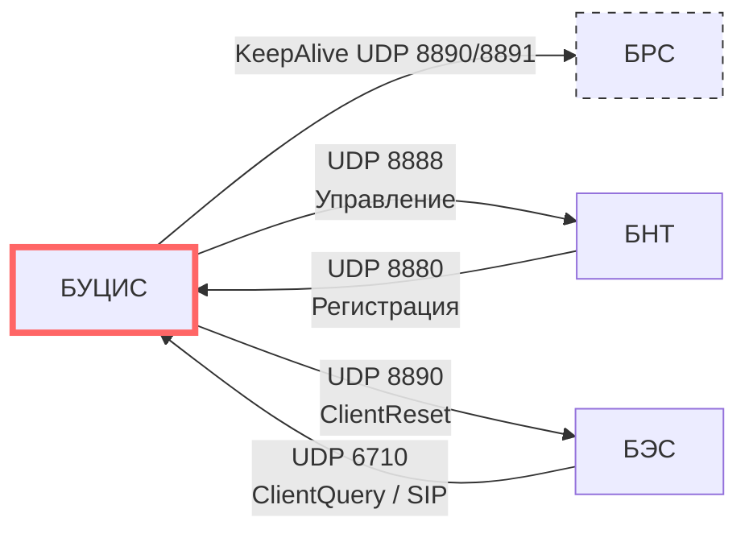
```mermaid
flowchart LR
    БУЦИС -->|"KeepAlive UDP 8890/8891"| БРС

    БУЦИС -->|"UDP 8888<br/>Управление"| БНТ
    БНТ -->|"UDP 8880<br/>Регистрация"| БУЦИС

    БУЦИС -->|"UDP 8890<br/>ClientReset"| БЭС
    БЭС -->|"UDP 6710<br/>ClientQuery / SIP"| БУЦИС

    style БУЦИС stroke:#f66,stroke-width:4px
    style БРС stroke:#333,stroke-dasharray: 5 5
```

| Блок                                                         | Назначение                                                                   |
| ------------------------------------------------------------ | ---------------------------------------------------------------------------- |
| **БУЦИС** (Блок Управления Цифровой Информационной Системой) | Головной управляющий компьютер кабины машиниста                              |
| **БНТ** (Блок Настенного Табло)                              | Информационный дисплей над дверями вагона (rboard)                           |
| **БЭС** (Блок Экстренной Связи)                              | Экстренная голосовая связь пассажир–машинист и оператор ситуационного центра |
| **БРС** (Блок Резервирования Связи)                          | Резервирование связи при отказе БУЦИС                                        |

### Общая технологическая платформа

| Параметр         | Значение                                               |
| ---------------- | ------------------------------------------------------ |
| Фреймворк        | Qt 5 (Network, Widgets, Multimedia, DBus, XML, OpenGL) |
| Целевая ОС       | Linux, встраиваемая платформа SECO / ARM Cortex-A9     |
| Транспорт        | UDP (команды, маршрут, keepalive), SIP/RTP (голос)     |
| Голосовой сервер | OpenSIPS (запускается на активном БУЦИС)               |

---

## 2. Схема взаимодействия

### 2.1. Общая топология системы

В составе две головы (два кабинных блока БУЦИС с IP .251 и .252). В каждый момент времени **активен только один БУЦИС** — он рассылает маршрут, держит OpenSIPS и принимает команды; второй находится в резерве. Головы обмениваются heartbeat по UDP 6710; при отсутствии ответа от активной головы резервная (при поддержке БРС) поднимает у себя OpenSIPS и перехватывает управление — все БЭС и табло переподключаются к новому активному узлу.

**Топология и сценарии работы** (нормальная работа, экстренный вызов, отказ основной головы):

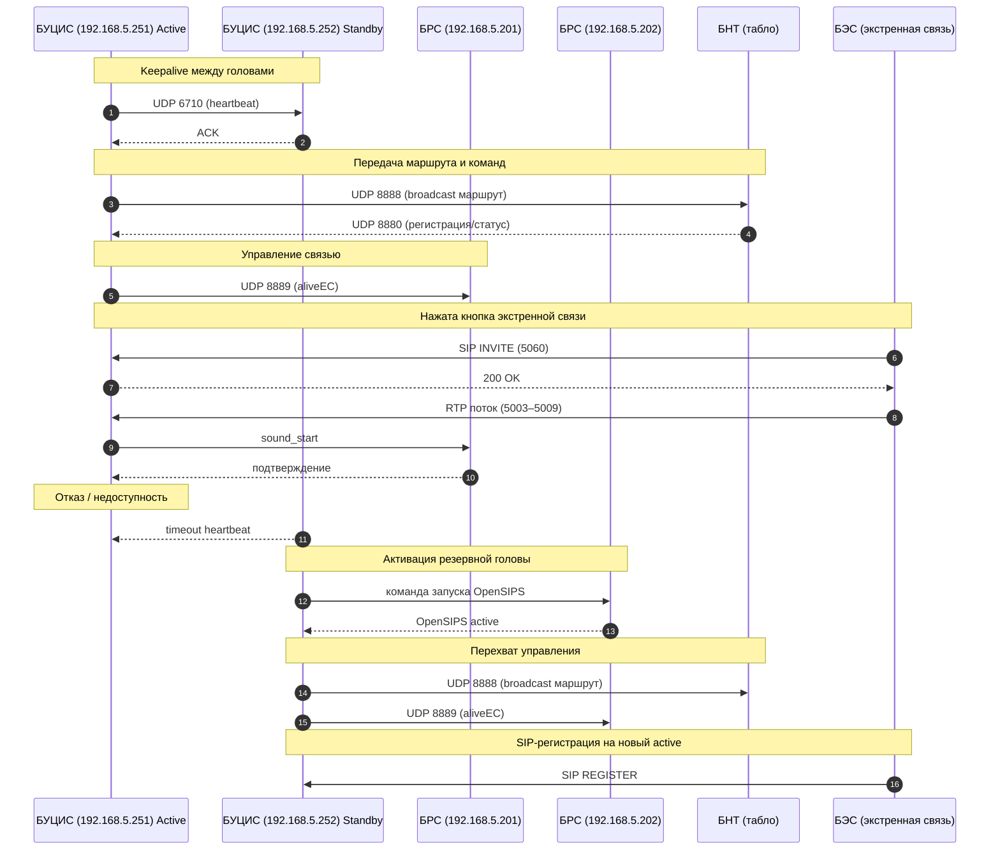
```mermaid
sequenceDiagram
    autonumber

    participant BUCIS1 as БУЦИС (192.168.5.251) Active
    participant BUCIS2 as БУЦИС (192.168.5.252) Standby
    participant BRS1 as БРС (192.168.5.201)
    participant BRS2 as БРС (192.168.5.202)
    participant BNT as БНТ (табло)
    participant BES as БЭС (экстренная связь)

    %% =====================================
    %% 1. НОРМАЛЬНАЯ РАБОТА
    %% =====================================
    Note over BUCIS1,BUCIS2: Keepalive между головами
    BUCIS1->>BUCIS2: UDP 6710 (heartbeat)
    BUCIS2-->>BUCIS1: ACK

    Note over BUCIS1,BNT: Передача маршрута и команд
    BUCIS1->>BNT: UDP 8888 (broadcast маршрут)
    BNT-->>BUCIS1: UDP 8880 (регистрация/статус)

    Note over BUCIS1,BRS1: Управление связью
    BUCIS1->>BRS1: UDP 8889 (aliveEC)

    %% =====================================
    %% 2. ЭКСТРЕННЫЙ ВЫЗОВ
    %% =====================================
    Note over BES,BUCIS1: Нажата кнопка экстренной связи
    BES->>BUCIS1: SIP INVITE (5060)
    BUCIS1-->>BES: 200 OK
    BES->>BUCIS1: RTP поток (5003–5009)
    BUCIS1->>BRS1: sound_start
    BRS1-->>BUCIS1: подтверждение

    %% =====================================
    %% 3. ОТКАЗ ОСНОВНОЙ ГОЛОВЫ
    %% =====================================
    Note over BUCIS1: Отказ / недоступность
    BUCIS2-->>BUCIS1: timeout heartbeat

    Note over BUCIS2,BRS2: Активация резервной головы
    BUCIS2->>BRS2: команда запуска OpenSIPS
    BRS2-->>BUCIS2: OpenSIPS active

    Note over BUCIS2,BNT: Перехват управления
    BUCIS2->>BNT: UDP 8888 (broadcast маршрут)
    BUCIS2->>BRS2: UDP 8889 (aliveEC)

    Note over BES,BUCIS2: SIP-регистрация на новый active
    BES->>BUCIS2: SIP REGISTER
```

### 2.2. Потоки данных по портам

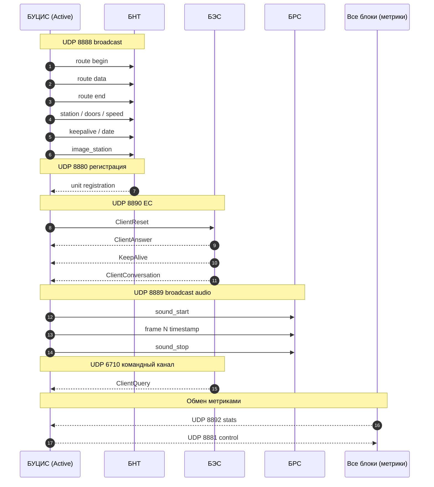
```mermaid
sequenceDiagram
    autonumber

    participant BUCIS as БУЦИС (Active)
    participant BNT as БНТ
    participant BES as БЭС
    participant BRS as БРС
    participant METRICS as Все блоки (метрики)

    %% =========================================
    %% 1. ОСНОВНОЙ BROADCAST 8888 (Маршрут)
    %% =========================================
    Note over BUCIS,BNT: UDP 8888 broadcast
    BUCIS->>BNT: route begin
    BUCIS->>BNT: route data
    BUCIS->>BNT: route end
    BUCIS->>BNT: station / doors / speed
    BUCIS->>BNT: keepalive / date
    BUCIS->>BNT: image_station

    %% Регистрация устройств
    Note over BNT,BUCIS: UDP 8880 регистрация
    BNT-->>BUCIS: unit registration

    %% =========================================
    %% 2. EC КАНАЛ 8890 (unicast)
    %% =========================================
    Note over BUCIS,BES: UDP 8890 EC
    BUCIS->>BES: ClientReset
    BES-->>BUCIS: ClientAnswer
    BES-->>BUCIS: KeepAlive
    BES-->>BUCIS: ClientConversation

    %% =========================================
    %% 3. СИНХРОННЫЙ ЗВУК 8889
    %% =========================================
    Note over BUCIS,BRS: UDP 8889 broadcast audio
    BUCIS->>BRS: sound_start
    BUCIS->>BRS: frame N timestamp
    BUCIS->>BRS: sound_stop

    %% =========================================
    %% 4. ДОПОЛНИТЕЛЬНЫЙ КАНАЛ 6710
    %% =========================================
    Note over BES,BUCIS: UDP 6710 командный канал
    BES-->>BUCIS: ClientQuery

    %% =========================================
    %% 5. МЕТРИКИ 8892 / 8881
    %% =========================================
    Note over BUCIS,METRICS: Обмен метриками
    METRICS-->>BUCIS: UDP 8892 stats
    BUCIS-->>METRICS: UDP 8881 control
```

### 2.3. Схема голосовой подсистемы (SIP/RTP)

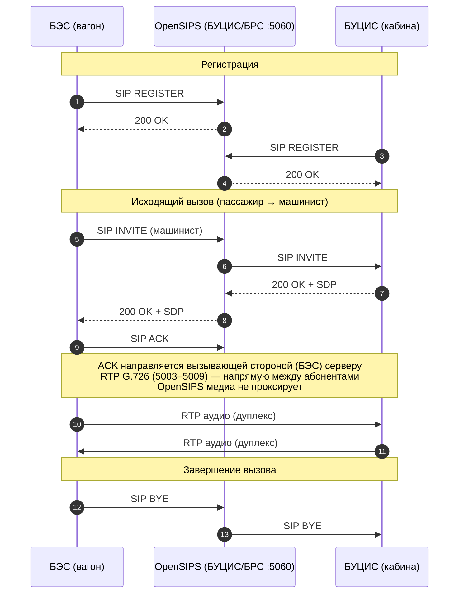
```mermaid
sequenceDiagram
    autonumber
    participant BES as БЭС (вагон)
    participant OS as OpenSIPS (БУЦИС/БРС :5060)
    participant BUCIS as БУЦИС (кабина)

    Note over BES,BUCIS: Регистрация
    BES->>OS: SIP REGISTER
    OS-->>BES: 200 OK
    BUCIS->>OS: SIP REGISTER
    OS-->>BUCIS: 200 OK

    Note over BES,BUCIS: Исходящий вызов (пассажир → машинист)
    BES->>OS: SIP INVITE (машинист)
    OS->>BUCIS: SIP INVITE
    BUCIS-->>OS: 200 OK + SDP
    OS-->>BES: 200 OK + SDP
    BES->>OS: SIP ACK

    Note over BES,BUCIS: ACK направляется вызывающей стороной (БЭС) серверу<br/>RTP G.726 (5003–5009) — напрямую между абонентами<br/>OpenSIPS медиа не проксирует

    BES->>BUCIS: RTP аудио (дуплекс)
    BUCIS->>BES: RTP аудио (дуплекс)

    Note over BES,BUCIS: Завершение вызова
    BES->>OS: SIP BYE
    OS->>BUCIS: SIP BYE
```

### IP-адреса

| Устройство                  | IP-адрес                 |
| --------------------------- | ------------------------ |
| БУЦИС (голова 1, основной)  | `192.168.5.251`          |
| БУЦИС (голова 2, резервный) | `192.168.5.252`          |
| БРС (голова / хвост)        | `192.168.5.201` / `.202` |
| БЭС, БНТ (вагоны)           | `192.168.5.x`            |
| Broadcast                   | `192.168.5.255`          |

---

## 3. БУЦИС

**Блок управления цифровой информационной системой**

### Назначение

Предназначен для управления работой блоков цифровой системы информирования и видеотрансляции «Москва 2022» вагонов Московского метрополитена. Центральный узел системы — инициирует маршрут, рассылает данные всем информационным блокам, управляет SIP-телефонией и принимает команды с пульта машиниста.

### Функции

| Функция              | Описание                                                            |
| -------------------- | ------------------------------------------------------------------- |
| Управление маршрутом | Чтение маршрутов из ФС, выбор линии/направления/станции, UI 800×480 |
| Рассылка BNT         | Отправка XML маршрута по UDP всем табло (БНТ)                       |
| SIP-телефония        | OpenSIPS на борту, связь кабина–БЭС и между кабинами через БРС      |
| Пульт машиниста      | Чтение нажатий с `/dev/ttymxc4` (RS-232), кнопки F1–F4, Play, Mic   |
| Keepalive / sys_info | Периодическая рассылка: скорость, яркость, температура              |
| Двойная тяга (УПО)   | Поддержка режима сдвоенного состава                                 |
| Метрики              | UDP 8881/8892 — сбор и отдача диагностических данных                |

### Внутренняя структура

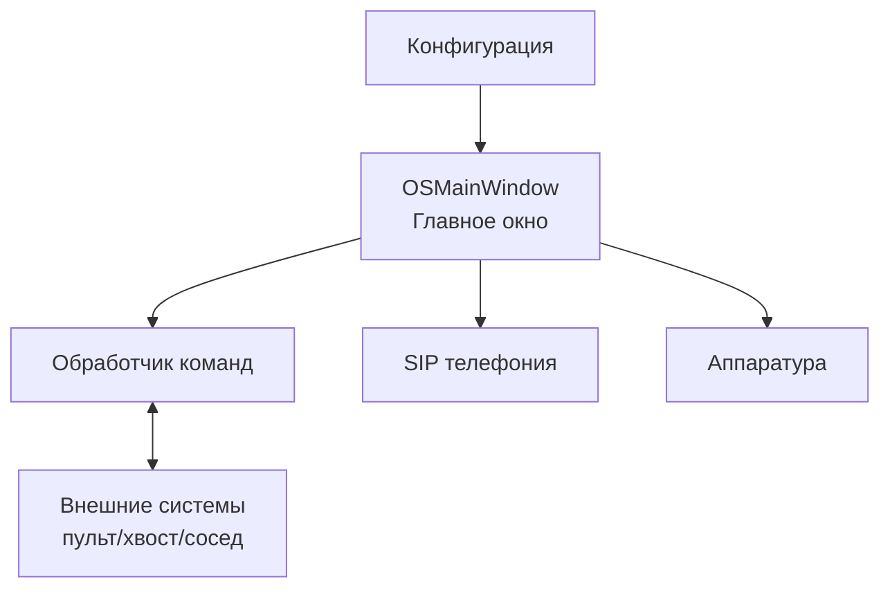
```mermaid
graph TD
    A[Конфигурация] --> B[OSMainWindow<br/>Главное окно]
    B --> C[Обработчик команд]
    B --> D[SIP телефония]
    B --> E[Аппаратура]

    C <--> F[Внешние системы<br/>пульт/хвост/сосед]
```

### UDP-порты

| Порт            | Направление          | Назначение                                                    |
| --------------- | -------------------- | ------------------------------------------------------------- |
| `6710` ¹        | Входящий             | Команды от хвоста / соседнего БУЦИС; приём ClientQuery от БЭС |
| `8880`          | Входящий (broadcast) | Регистрация устройств (unit-пакеты)                           |
| `8888`          | Исходящий            | Рассылка маршрута и команд                                    |
| `8889`          | Двусторонний         | Синхронный звук                                               |
| `8890`          | Двусторонний         | EC keepalive                                                  |
| `8891`          | Двусторонний         | PGK keepalive                                                 |
| `8892` / `8881` | Двусторонний         | Метрики                                                       |

¹ **Рассогласование портов:** в `Manager/proto.h` задан `PORT_LISTEN_BUCIS = 7777`, тогда как в `UdpHandler/proto.h` используется `6710`. При развёртывании необходимо убедиться, что значение согласовано между кодом БУЦИС и кодом БЭС. Подробнее — в разделе 10.5.

### Основные UDP-команды (исходящие на БНТ)

| Команда            | Аргументы                                     | Назначение                                                                                          |
| ------------------ | --------------------------------------------- | --------------------------------------------------------------------------------------------------- |
| `route begin`      | —                                             | Начало передачи маршрута                                                                            |
| `route data`       | XML-фрагмент                                  | Фрагмент BNT XML                                                                                    |
| `route end`        | CRC32                                         | Конец маршрута, контрольная сумма                                                                   |
| `station`          | `num state`                                   | Текущая станция (0=прибытие, 1=отправление)                                                         |
| `doors`            | `state_l state_r`                             | Состояние дверей                                                                                    |
| `speed`            | `value`                                       | Скорость (км/ч)                                                                                     |
| `temperature`      | `value`                                       | Температура в салоне                                                                                |
| `keepalive`        | `IP;speed;date;temp;timeStation;Compositions` | Heartbeat каждые 2 с (IP, скорость, дата, температура, время до ближайшей станции, кол-во составов) |
| `sys_time_stn`     | `t1;t2;...`                                   | Время до ближайших станций (сек)                                                                    |
| `date`             | `MMddhhmmyyyy.ss`                             | Синхронизация времени                                                                               |
| `reg_data_request` | —                                             | Запрос данных устройства                                                                            |

### Конфигурационные файлы

#### `bucis-12.ini` — основной конфиг

| Секция / ключ             | Назначение                                                                         |
| ------------------------- | ---------------------------------------------------------------------------------- |
| `[ipset1]` / `[ipset2]`   | Два набора IP-адресов (головной/хвостовой или два состава); переключаются командой |
| `[network]` ports         | Порты SUI/SUE (3344–3345), SVNI/SVNE, хост (3342), broadcast                       |
| `[brightness]`            | Уровень яркости дисплея (через sysfs или по командам от SU)                        |
| `[gst-pipeline]`          | GStreamer-пайплайны: `mic2net`, `net2ext`, `mic2head`, `head2play`, запись         |
| `[paths]`                 | Пути к каталогам маршрутов (`routes/`), записям (`audiorecords/`)                  |
| `[upo]` / `[doubletrain]` | Пороги детектора уровня звука, путь к файлу активации двойной тяги                 |
| `[volume]`                | Уровень громкости воспроизведения                                                  |
| `[keys]`                  | Порт пульта машиниста (по умолчанию `/dev/ttymxc4`)                                |
| `[rtp]`                   | Порты RTP/записи: 5004–5009, 1234 и др.                                            |

#### `settings.ini` — переопределение параметров

Генерируется или переопределяет отдельные параметры основного конфига: GStreamer pipeline, флаги `UNIT` и `IS_BUSIC`. Используется для адаптации под конкретный экземпляр оборудования без изменения основного файла.

#### `setup.ini` — альтернативный набор

Содержит: `carnum` (номер вагона), `ipset` (выбор набора IP), `route` (маршрут по умолчанию), `volume`, `keys`.

#### Bind-файлы (`*.bind`) — SIP-учётки

По одному файлу на каждого абонента (БЭС). Парсятся `BindFileParser`, создаются и обновляются через `SettingsService` + `FileWatcher` (автоматическое обнаружение изменений).

| Поле                      | Назначение                             |
| ------------------------- | -------------------------------------- |
| `DOMAIN`                  | SIP-домен (OpenSIPS на активном БУЦИС) |
| `USER` / `PASS`           | Учётные данные SIP                     |
| `URI`                     | SIP URI абонента                       |
| `DEST_IP` / `DEST`        | Адрес назначения вызова                |
| `PROXY`                   | SIP-прокси                             |
| `PORT_SIP`                | Порт SIP-сигнализации (5060)           |
| `PORT_DRTP` / `PORT_SRTP` | Порты RTP приёма/передачи              |
| `PORT_REC1` / `PORT_REC2` | Порты записи                           |

При смене активного БУЦИС (резервирование) `KeepAlive`-пакет несёт новый IP OpenSIPS — БЭС перечитывает bind-файл и перерегистрируется автоматически.

#### Файлы состояния (runtime, `/tmp/`)

| Файл                        | Назначение                  |
| --------------------------- | --------------------------- |
| `/tmp/bucis-12_activation`  | Флаг режима УПО (активация) |
| `/tmp/bucis-12_doubletrain` | Флаг режима двойной тяги    |

---

## 4. БНТ

**Блок наддверного табло**
Разрешение: 3840×459

### Назначение

Предназначен для отображения текстовых и мнемонических сообщений о маршруте движения электропоезда. Устанавливается над дверями в салоне вагона. Отображает схему маршрута, текущую и следующую станции, скорость, температуру, состояние дверей, время до станций и оперативные сообщения. Рендеринг через OpenGL ES + QPainter.

### Компоненты

| Компонент         | Назначение                                          |
| ----------------- | --------------------------------------------------- |
| `MainGLWindow`    | OpenGL-окно, `paintGL()` + `paintOverGL()`          |
| `CommandHandler`  | Разбор UDP-команд, эмиссия сигналов                 |
| `UdpProvider`     | UDP 8888 (приём) / 8880 (регистрация)               |
| `RouteMgr`        | Приём BNT/XML, хранение `Line`, сигнал `lineLoad`   |
| `BntParser`       | Парсинг XML → `Line`, `StationItem`, `TransferItem` |
| `RouteRendering`  | Рендеринг маршрута, анимации, PNG станций           |
| `OpsRendering`    | Оперативные сообщения поверх маршрута (порт 8089)   |
| `Device`          | Синглтон: тип, MAC/IP, разрешение, сторона борта    |
| `QSerialPortSeco` | Сторона борта L/R из `ttyS0` / `ttyS1`              |
| `osCRC32`         | CRC32 для проверки маршрута и PNG                   |

### Поток данных

**Внешний обмен (БУЦИС ↔ БНТ):**

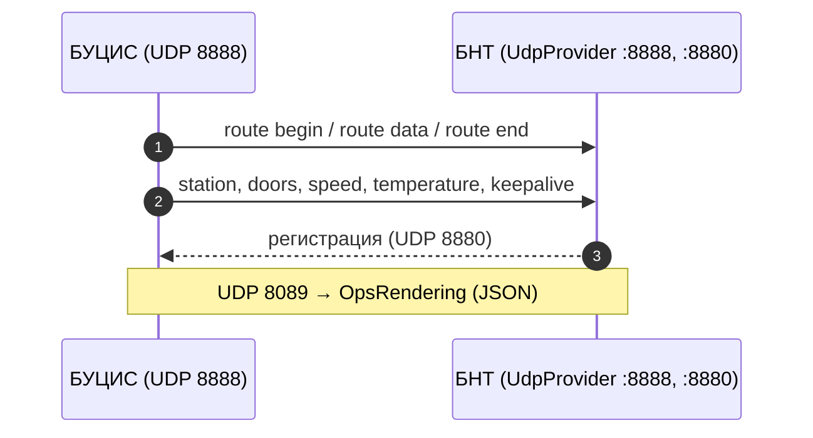
```mermaid
sequenceDiagram
    autonumber
    participant BUCIS as БУЦИС (UDP 8888)
    participant BNT as БНТ (UdpProvider :8888, :8880)
    BUCIS->>BNT: route begin / route data / route end
    BUCIS->>BNT: station, doors, speed, temperature, keepalive
    BNT-->>BUCIS: регистрация (UDP 8880)
    Note over BUCIS,BNT: UDP 8089 → OpsRendering (JSON)
```

**Внутренняя архитектура БНТ (компоненты и вызовы):**

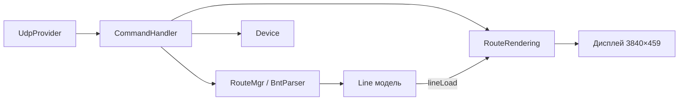
```mermaid
graph LR
    UDP[UdpProvider] --> Cmd[CommandHandler]
    Cmd --> Route[RouteMgr / BntParser]
    Route --> Line[Line модель]
    Cmd --> Render[RouteRendering]
    Line -->|lineLoad| Render
    Cmd --> Device[Device]
    Render --> Display[Дисплей 3840×459]
```

### Основные UDP-команды

| Команда                                | Аргументы                                     | Действие                                                                                          |
| -------------------------------------- | --------------------------------------------- | ------------------------------------------------------------------------------------------------- |
| `route begin` / `data` / `end`         | CRC32                                         | Передача и парсинг BNT XML                                                                        |
| `image_station begin` / `data` / `end` | CRC32                                         | Передача PNG-изображений станций                                                                  |
| `station`                              | `num state`                                   | Текущая станция (0=прибытие, 1=отправление)                                                       |
| `doors`                                | `state_l state_r`                             | Состояние дверей                                                                                  |
| `speed`                                | `value`                                       | Скорость (км/ч)                                                                                   |
| `temperature`                          | `value`                                       | Температура в салоне                                                                              |
| `keepalive`                            | `IP;speed;date;temp;timeStation;Compositions` | Heartbeat от БУЦИС (IP, скорость, дата, температура, время до ближайшей станции, кол-во составов) |
| `sys_time_stn`                         | `t1;t2;...`                                   | Время до ближайших станций                                                                        |
| `date`                                 | `MMddhhmmyyyy.ss`                             | Синхронизация времени                                                                             |
| `reset`                                | —                                             | Сброс, повторная регистрация                                                                      |
| `work_from_battery`                    | `0\|1`                                        | Управление PWM/яркостью                                                                           |

### Порты

| Порт            | Назначение                                          |
| --------------- | --------------------------------------------------- |
| `8888`          | Приём команд от БУЦИС                               |
| `8880`          | Ответы и регистрация (broadcast)                    |
| `8089`          | Оперативные сообщения (JSON)                        |
| `6666`          | Тест: при получении данных → `systemctl start test` |
| `8892` / `8881` | Метрики                                             |

---

## 5. БЭС

**Блок экстренной связи**
Приложения: `Manager`, `UdpHandler`, `LedHandler`, `ButtonHandler`

### Назначение

Предназначен для обеспечения пассажиров поездов метрополитена экстренной дуплексной голосовой связью с машинистом и с оператором ситуационного центра. Устанавливается в каждом вагоне. Управляется одной кнопкой, состояние индицируется светодиодами.

### Архитектура: процессы и D-Bus

Устройство одновременно запускает несколько процессов, взаимодействующих через **D-Bus (system bus)**:

| Процесс         | D-Bus сервис                          | Роль                                      |
| --------------- | ------------------------------------- | ----------------------------------------- |
| `Manager`       | `BES28.BusicInformator` (режим Busic) | Логика БЭС/БУЦИС, SIP, RTP, bind-файлы    |
| `UdpHandler`    | `BES28.UdpHandler`                    | UDP-шлюз: пакеты → D-Bus сигналы          |
| `LedHandler`    | `BES28.LedHandler`                    | Управление LED по состояниям (GPIO + PWM) |
| `ButtonHandler` | `BES28.ButtonHandler`                 | Опрос кнопки (GPIO), сигнал `onClick`     |
| `Player`        | `BES28.TestHandler`                   | Тест звука: 300/1000/3200 Гц, запись      |

### Режимы работы

БЭС поддерживает два режима, задаваемых флагом `isBusic` в `settings.ini`:

**Режим BES** (абонентский блок в вагоне):

- Проходит регистрацию через UDP (ClientReset → ClientQuery → ClientAnswer)
- После регистрации кнопка инициирует SIP-звонок на машиниста
- Получает keepalive от БУЦИС — при смене активной головы перепривязывает SIP

**Режим Busic** (головное устройство):

- Нет процедуры регистрации в составе
- Кнопка напрямую → TelephoneHandler (звонок/ответ)
- Пробрасывает SIP-события в D-Bus через `DbusBusicInformator`

### Конечный автомат (режим BES)

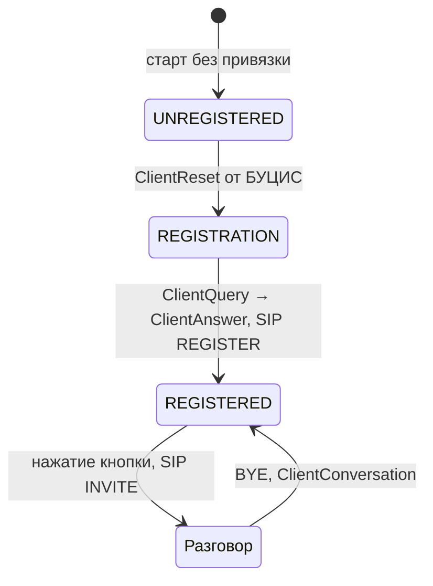
```mermaid
stateDiagram-v2
    [*] --> UNREGISTERED: старт без привязки
    UNREGISTERED --> REGISTRATION: ClientReset от БУЦИС
    REGISTRATION --> REGISTERED: ClientQuery → ClientAnswer, SIP REGISTER
    REGISTERED --> Разговор: нажатие кнопки, SIP INVITE
    Разговор --> REGISTERED: BYE, ClientConversation
```

### Состояния LED

| Состояние                  | Индикация               |
| -------------------------- | ----------------------- |
| Ожидание регистрации       | Медленное мигание (PWM) |
| Регистрация                | Частое мигание          |
| Зарегистрирован (ожидание) | Постоянный свет         |
| Разговор                   | Быстрое мигание         |
| Очередь                    | Пульсация               |

### UDP-пакеты

| Пакет                | Порт            | Направление  | Описание                                  |
| -------------------- | --------------- | ------------ | ----------------------------------------- |
| `ClientReset`        | `8890`          | БУЦИС → БЭС  | Начало регистрации (IP_BUCIS1, IP_BUCIS2) |
| `ClientQuery`        | `6710` ¹        | БЭС → БУЦИС  | Запрос регистрации (MAC + нажатие кнопки) |
| `ClientAnswer`       | `8890`          | БУЦИС → БЭС  | Ответ: `sipId` + `newIp`                  |
| `KeepAlive`          | `8890`          | БУЦИС → БЭС  | Heartbeat: IP активного OpenSIPS          |
| `ClientConversation` | `8890`          | БУЦИС → БЭС  | Остановка таймера разговора по `sipId`    |
| `TestCmd`            | `8888`          | Tester → БЭС | 300/1000/3200 Гц, record, LED-тест        |
| Metrics              | `8892` / `8881` | Двусторонний | Диагностика                               |

¹ **Рассогласование портов:** в `Manager/proto.h` задан `PORT_LISTEN_BUCIS = 7777`, тогда как в `UdpHandler/proto.h` используется `6710`. При развёртывании необходимо убедиться, что значение согласовано. Подробнее — в разделе 10.5.

### Сценарий голосового вызова

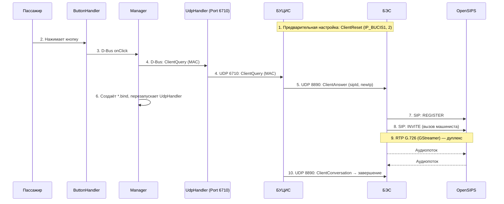
```mermaid
sequenceDiagram
    participant Пассажир
    participant ButtonHandler
    participant Manager
    participant UdpHandler as UdpHandler (Port 6710)
    participant БУЦИС
    participant БЭС
    participant OpenSIPS

    Note over БУЦИС,БЭС: 1. Предварительная настройка: ClientReset (IP_BUCIS1, 2)

    Пассажир->>ButtonHandler: 2. Нажимает кнопку
    ButtonHandler->>Manager: 3. D-Bus onClick

    Manager->>UdpHandler: 4. D-Bus: ClientQuery (MAC)
    UdpHandler->>БУЦИС: 4. UDP 6710: ClientQuery (MAC)

    БУЦИС->>БЭС: 5. UDP 8890: ClientAnswer (sipId, newIp)

    Manager->>Manager: 6. Создаёт *.bind, перезапускает UdpHandler

    БЭС->>OpenSIPS: 7. SIP: REGISTER
    БЭС->>OpenSIPS: 8. SIP: INVITE (вызов машиниста)

    Note over БЭС,OpenSIPS: 9. RTP G.726 (GStreamer) — дуплекс
    БЭС-->>OpenSIPS: Аудиопоток
    OpenSIPS-->>БЭС: Аудиопоток

    БУЦИС->>БЭС: 10. UDP 8890: ClientConversation → завершение
```

---

## 6. БРС

**Блок резервирования связи**
Приложения: `Manager`, `UdpHandler`, `Player`, `ButtonHandler`

### Назначение

В составе ЦСИВ обеспечивает резервирование экстренной, межкабинной и громкой связи в случае выхода из строя блока управления БУЦИС. Устанавливается в голове и хвосте состава. Реализует SIP-телефонию с автоматическим определением и переключением на активный узел.

### Процессы

| Процесс         | Назначение                                                         |
| --------------- | ------------------------------------------------------------------ |
| `Manager`       | Логика резервирования, SIP, выбор OpenSIPS, воспроизведение треков |
| `UdpHandler`    | UDP-шлюз: keepalive/EC/тест → D-Bus сигналы; отправка ответов      |
| `Player`        | Тест звука на устройстве: 300/1000/3200 Гц, запись                 |
| `Tester` (ПК)   | Desktop GUI для управления тестами по UDP                          |
| `ButtonHandler` | Опрос кнопок (GPIO), сигналы `clicked` / `clickedTD`               |
| `GpioLib`       | Библиотека GPIO через sysfs (`/sys/class/gpio`)                    |

### Алгоритм резервирования БУЦИС

БРС использует таймер (1 сек) и счётчики keepalive. В каждый момент времени OpenSIPS поднят только на одном узле сети:

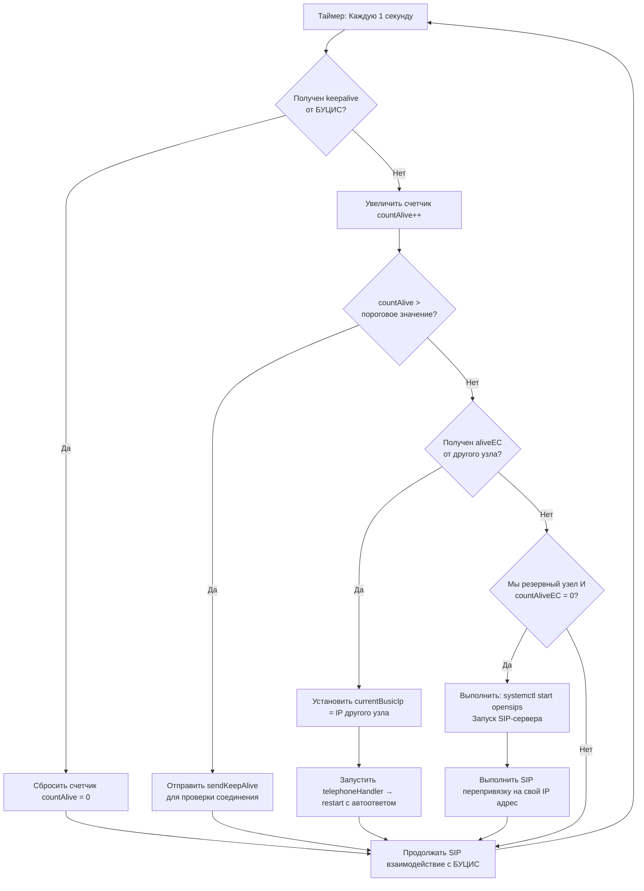
```mermaid
flowchart TD
    T[Таймер: Каждую 1 секунду] --> C1{Получен keepalive<br>от БУЦИС?}

    C1 -->|Да| A[Сбросить счетчик countAlive = 0]
    A --> N[Продолжать SIP взаимодействие с БУЦИС]

    C1 -->|Нет| B[Увеличить счетчик countAlive++]
    B --> C2{countAlive ><br>пороговое значение?}

    C2 -->|Да| K[Отправить sendKeepAlive<br>для проверки соединения]
    K --> N

    C2 -->|Нет| C3{Получен aliveEC<br>от другого узла?}

    C3 -->|Да| IP[Установить currentBusicIp = IP другого узла]
    IP --> TH[Запустить telephoneHandler → restart с автоответом]
    TH --> N

    C3 -->|Нет| C4{Мы резервный узел И<br>countAliveEC = 0?}

    C4 -->|Да| SO[Выполнить: systemctl start opensips<br>Запуск SIP-сервера]
    SO --> SIP[Выполнить SIP перепривязку на свой IP адрес]
    SIP --> N

    C4 -->|Нет| N

    N --> T
```

### Взаимодействие процессов (D-Bus)

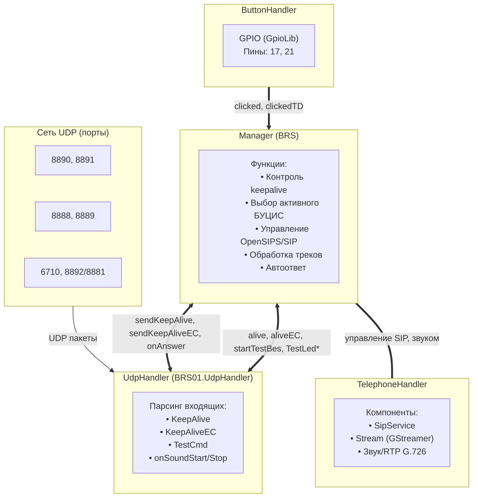
```mermaid
flowchart TB
    subgraph UDP_Network ["Сеть UDP (порты)"]
        direction LR
        P1["8890, 8891"]
        P2["8888, 8889"]
        P3["6710, 8892/8881"]
    end

    subgraph UDP_Handler ["UdpHandler (BRS01.UdpHandler)"]
        direction TB
        UP["Парсинг входящих:
            • KeepAlive
            • KeepAliveEC
            • TestCmd
            • onSoundStart/Stop"]
    end

    subgraph Manager ["Manager (BRS)"]
        direction TB
        M["Функции:
            • Контроль keepalive
            • Выбор активного БУЦИС
            • Управление OpenSIPS/SIP
            • Обработка треков
            • Автоответ"]
    end

    subgraph Telephone ["TelephoneHandler"]
        direction TB
        TH["Компоненты:
            • SipService
            • Stream (GStreamer)
            • Звук/RTP G.726"]
    end

    subgraph Button ["ButtonHandler"]
        direction TB
        BH["GPIO (GpioLib)
            Пины: 17, 21"]
    end

    UDP_Network -->|UDP пакеты| UDP_Handler

    UDP_Handler <==>|alive, aliveEC, startTestBes, TestLed*| Manager
    Manager <==>|sendKeepAlive, sendKeepAliveEC, onAnswer| UDP_Handler

    Manager ===|управление SIP, звуком| Telephone

    Button ==>|clicked, clickedTD| Manager
```

### UDP-порты

| Порт            | Назначение                                                     |
| --------------- | -------------------------------------------------------------- |
| `8890`          | EC keepalive (`ec_server_keepalive`, `ec_client_conversation`) |
| `8891`          | Обычный keepalive БУЦИС                                        |
| `8888`          | Тест: stop, record, 300/1000/3200, TestLed, startTestBes       |
| `8889`          | Синхронный звук (`sound_start` / `sound_stop`)                 |
| `8892` / `8881` | Метрики                                                        |

### Режимы телефона

| Режим           | Описание                |
| --------------- | ----------------------- |
| `UNDEFINED`     | Начальное состояние     |
| `REGISTRATION`  | Регистрация на OpenSIPS |
| `REGISTERED`    | Готов к звонкам         |
| `INCOMING_CALL` | Входящий вызов          |
| `CALLING`       | Исходящий вызов         |
| `ANSWERED`      | Вызов принят            |
| `CALL`          | Активный разговор       |

---

## 7. Сетевая инфраструктура

### Сводная таблица UDP-портов

| Порт            | Протокол      | Источник         | Получатель | Содержание                                                      |
| --------------- | ------------- | ---------------- | ---------- | --------------------------------------------------------------- |
| `8888`          | UDP           | БУЦИС            | БНТ и др.  | Маршрут, station, speed, doors, keepalive                       |
| `8880`          | UDP broadcast | Все блоки        | БУЦИС      | Регистрация (unit-пакеты)                                       |
| `8089`          | UDP           | БУЦИС            | БНТ        | Оперативные сообщения (JSON)                                    |
| `6666`          | UDP           | Tester           | Все блоки  | Тест: `test_start` → переключение в тестовый режим              |
| `6710`          | UDP           | БЭС              | БУЦИС      | `ClientQuery` при регистрации (**см. примечание о порте ниже**) |
| `8890`          | UDP           | БУЦИС ↔ БЭС/БРС  | —          | EC keepalive, ClientReset/Answer                                |
| `8891`          | UDP           | БУЦИС → БРС      | —          | Обычный keepalive (PGK)                                         |
| `8892` / `8881` | UDP           | Все блоки        | —          | Метрики                                                         |
| `5060`          | SIP/UDP       | OpenSIPS (БУЦИС) | БЭС, БРС   | REGISTER, INVITE, BYE                                           |
| `5003–5009`     | RTP/UDP       | БЭС, БРС         | —          | Аудиопотоки G.726 (GStreamer)                                   |

---

## 8. Протоколы взаимодействия

### Передача маршрута (BNT)

Маршрут передаётся фрагментами XML по UDP. Целостность контролируется **CRC32**.

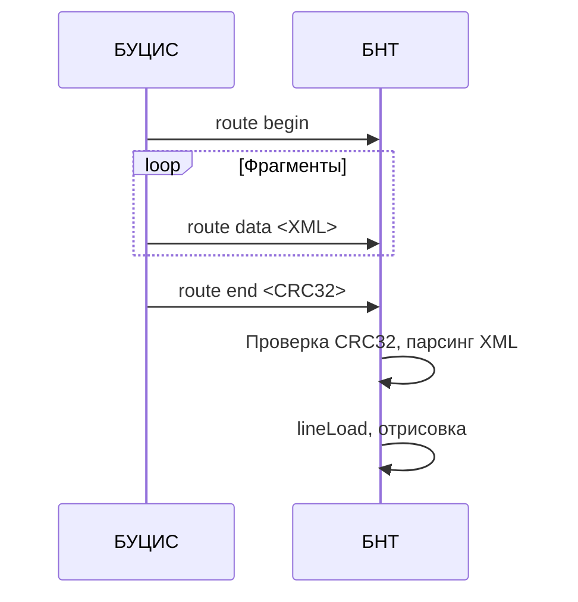
```mermaid
sequenceDiagram
    participant B as БУЦИС
    participant N as БНТ
    B->>N: route begin
    loop Фрагменты
        B->>N: route data <XML>
    end
    B->>N: route end <CRC32>
    N->>N: Проверка CRC32, парсинг XML
    N->>N: lineLoad, отрисовка
```

```
БУЦИС → 192.168.5.255:8888 (broadcast):

    route begin
    route data <XML-фрагмент>
    route data <XML-фрагмент>
    ...
    route end <CRC32_hex>
```

Получатель (БНТ, RouteMgr):

1. Накапливает фрагменты в буфер
2. При `route end` вычисляет CRC32 и сравнивает с полученным
3. Совпадение → парсит XML, переключает рендер (`lineLoad`)
4. Несовпадение → очищает буфер, отправляет повторную регистрацию

### Формат BNT XML

```xml
<line name="Кольцевая" isround="true">
  <icon char="К" color="#DD0000"/>
  <station name="Комсомольская" metro-transfer="true" skip="false">
    <transfer name="Ленинградская">
      <icon char="Н" color="#0000FF"/>
    </transfer>
  </station>
  <station name="Проспект Мира" side="right" skip="false">
    <feature type="ring-right"/>
  </station>
</line>
```

| Поле                     | Тип        | Описание                                                       |
| ------------------------ | ---------- | -------------------------------------------------------------- |
| `line.name`              | string     | Название линии (несколько через `\|`)                          |
| `line.isround`           | bool       | Кольцевая линия                                                |
| `icon.char`              | char       | Символ иконки линии                                            |
| `icon.color`             | hex        | Цвет иконки                                                    |
| `station.name`           | string     | Название станции                                               |
| `station.metro-transfer` | bool       | Пересадка на другую линию метро                                |
| `station.skip`           | bool       | Пропустить при отображении                                     |
| `station.side`           | left/right | Сторона выхода                                                 |
| `transfer.name`          | string     | Название пересадочной линии                                    |
| `feature.type`           | enum       | Особенность: `ring-left`, `ring-right`, `river`, `closed`, ... |

### Регистрация устройства

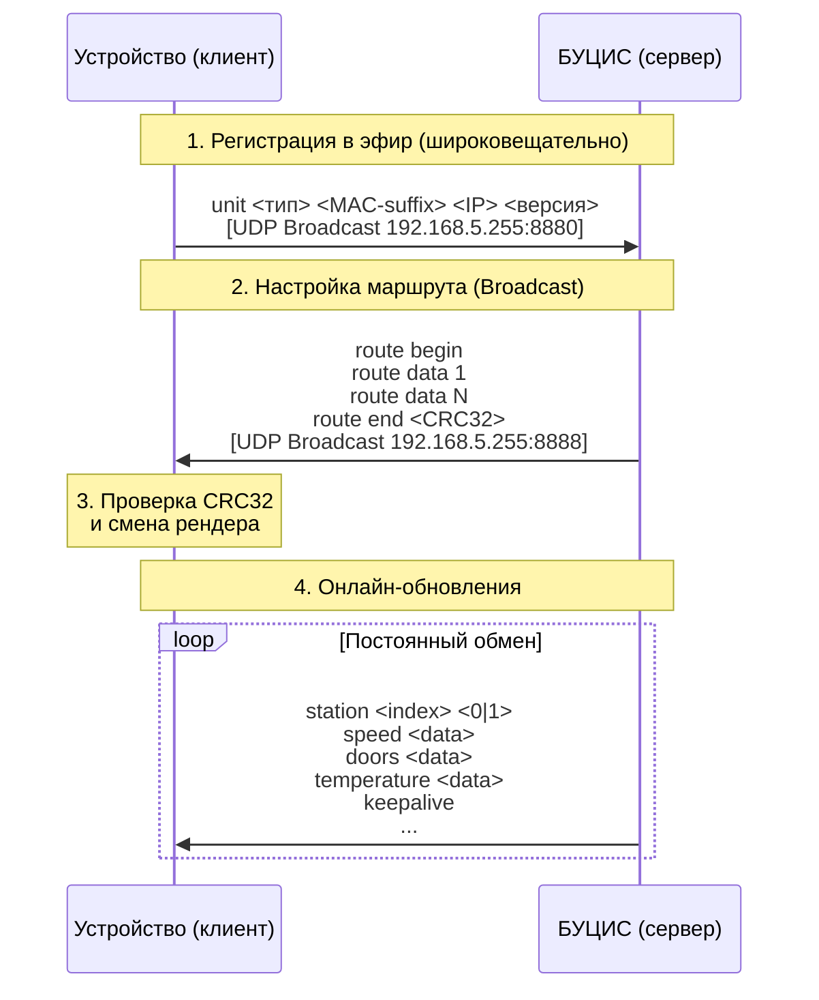
```mermaid
sequenceDiagram
    participant У as Устройство (клиент)
    participant Б as БУЦИС (сервер)

    Note over У,Б: 1. Регистрация в эфир (широковещательно)
    У->>Б: unit <тип> <MAC-suffix> <IP> <версия><br/>[UDP Broadcast 192.168.5.255:8880]

    Note over Б,У: 2. Настройка маршрута (Broadcast)
    Б->>У: route begin<br/>route data 1<br/>route data N<br/>route end <CRC32><br/>[UDP Broadcast 192.168.5.255:8888]

    Note over У: 3. Проверка CRC32<br/>и смена рендера

    Note over У,Б: 4. Онлайн-обновления
    loop Постоянный обмен
        Б->>У: station <index> <0|1><br/>speed <data><br/>doors <data><br/>temperature <data><br/>keepalive<br/>...
    end
```

### SIP-архитектура голосовой связи

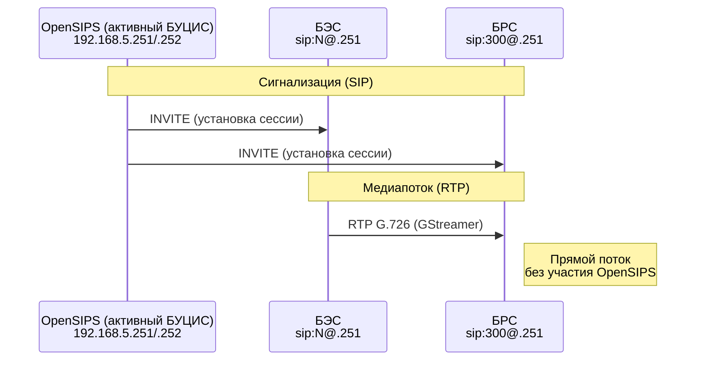
```mermaid
sequenceDiagram
    participant OpenSIPS as OpenSIPS (активный БУЦИС)<br/>192.168.5.251/.252
    participant БЭС as БЭС<br/>sip:N@.251
    participant БРС as БРС<br/>sip:300@.251

    Note over OpenSIPS,БРС: Сигнализация (SIP)
    OpenSIPS->>БЭС: INVITE (установка сессии)
    OpenSIPS->>БРС: INVITE (установка сессии)

    Note over БЭС,БРС: Медиапоток (RTP)
    БЭС->>БРС: RTP G.726 (GStreamer)
    Note right of БРС: Прямой поток<br/>без участия OpenSIPS
```

При отказе активного БУЦИС БРС автоматически поднимает OpenSIPS на себе — все SIP-клиенты перерегистрируются на новый IP.

---

## 8.1. Голосовые оповещения в системе

В системе «Сармат» голос задействован в нескольких сценариях: объявления по маршруту, экстренная и межкабинная связь по SIP, громкая связь по составу и служебные звуки на блоках.

### Объявления по маршруту (БУЦИС)

| Что                 | Как реализовано                                                                                  |
| ------------------- | ------------------------------------------------------------------------------------------------ |
| **Источник**        | БУЦИС: выбор маршрута/линии/станции из ФС (каталоги с `MP3`, `BNT`, `config.ini`).               |
| **Воспроизведение** | `QMediaPlayer` и/или GStreamer (pipeline из `bucis-12.ini`, секция `[gst-pipeline]`).            |
| **Привязка**        | К станциям и доп. контенту: `playStation()`, `playExtra()`, синхронизация по таймеру и командам. |
| **Назначение**      | Озвучивание названий станций и служебных сообщений в кабине/по необходимости в состав.           |

Объявления по маршруту воспроизводятся локально на БУЦИС; при необходимости синхронный вывод в состав — через механизм синхронного звука (см. ниже).

### Синхронный звук по составу (UDP 8889)

Единый механизм «включить/выключить» звук на всех блоках, слушающих порт **8889**:

| Участник  | Роль                                                                                                                                                                                                |
| --------- | --------------------------------------------------------------------------------------------------------------------------------------------------------------------------------------------------- |
| **БУЦИС** | Инициирует `sound_start` / `sound_stop` при воспроизведении файла по маршруту, при включении микрофона (громкая связь) или записи; шлёт по broadcast на порт 8889.                                  |
| **БРС**   | Слушает 8889; при `sound_start` запускает локальный GStreamer (RTP или файл), при `sound_stop` останавливает; при кнопке «тангента» сам шлёт `sound_start` (тип 2 — микрофон) и затем `sound_stop`. |
| **БНТ**   | Порт 8889 в основном для синхронного звука не описан в документации БНТ; при необходимости приём 8889 может быть добавлен на табло.                                                                 |

Формат команды: `sound_start <тип>;<timestamp_ms>;`, где тип `1` — воспроизведение файла (объявление по станции), тип `2` — микрофон (громкая связь). Точные строки GStreamer pipeline, используемые на БУЦИС для кодирования и отправки RTP, задаются в `bucis-12.ini` (секция `[gst-pipeline]`) и в публично доступных материалах не раскрыты.

Подробные сценарии синхронного воспроизведения описаны в отдельных документах: **StationAnnouncement.md** (объявление по станции) и **DoorsCloseSound.md** («Осторожно, двери закрываются»).

Таким образом, **голосовые оповещения по составу** (объявления + громкая связь) обеспечиваются рассылкой команд по UDP 8889 и синхронным стартом по таймштампу.

### Экстренная и межкабинная связь (SIP/RTP)

| Что               | Как реализовано                                                                                          |
| ----------------- | -------------------------------------------------------------------------------------------------------- |
| **Сигнализация**  | SIP (Sofia-SIP): REGISTER к OpenSIPS, INVITE/BYE между абонентами. Порт 5060.                            |
| **Аудио**         | RTP, кодек G.726. GStreamer (pipeline с `avenc_g726`, `rtpg726pay`, `udpsink` / приём). Порты 5003–5009. |
| **Кто звонит**    | БЭС (пассажир) → машинист (БУЦИС) или БРС; БУЦИС/БРС между кабинами.                                     |
| **Перевод на СЦ** | Через ту же SIP-инфраструктуру (шлюз или внешний SIP оператора СЦ).                                      |

Звонок не является «оповещением» в смысле трансляции по составу — это дуплексный разговор между двумя абонентами.

### Служебные звуки на блоках (БЭС, БРС)

| Блок    | Звуки                                               | Источник                                                                          |
| ------- | --------------------------------------------------- | --------------------------------------------------------------------------------- |
| **БЭС** | Ответ (onSpeak), занято (onBusy), окончание (onEnd) | Треки из `/opt/sarmat/tracks/`, воспроизведение через GStreamer при событиях SIP. |
| **БРС** | Аналогично: занято, конец вызова, вход в связь      | Треки в `/opt/sarmat/tracks/`, настройки в `settings.ini` (GSTREAMER, UNIT).      |

Итог: **голосовые оповещения** в Сармат — это (1) объявления по маршруту на БУЦИС, (2) синхронный звук по составу по UDP 8889 (`sound_start`/`sound_stop`), (3) SIP/RTP для экстренной и межкабинной связи, (4) служебные треки на БЭС/БРС при событиях телефонии.

---

## 8.2. Подробное взаимодействие между блоками

Ниже — кто с кем обменивается, по какому порту и какому протоколу.

### Матрица взаимодействий

| От кого   | К кому          | Порт       | Протокол/команды                                                                                                      | Назначение                                         |
| --------- | --------------- | ---------- | --------------------------------------------------------------------------------------------------------------------- | -------------------------------------------------- |
| **БУЦИС** | Все (broadcast) | 8888       | UDP, текст: `route begin/data/end`, `station`, `doors`, `speed`, `temperature`, `keepalive`, `date`, `image_station`… | Маршрут, состояние, heartbeat для БНТ и др.        |
| **БУЦИС** | Все (broadcast) | 8889       | UDP: `sound_start N;ts;`, `sound_stop`                                                                                | Синхронный звук по составу                         |
| **БУЦИС** | БЭС (вагоны)    | 8890       | UDP: ClientReset, ClientAnswer, KeepAlive, ClientConversation                                                         | Регистрация БЭС, IP OpenSIPS, завершение разговора |
| **БУЦИС** | БРС (головы)    | 8890, 8891 | UDP: ec_server_keepalive, keepalive                                                                                   | Поддержание EC, определение активной головы        |
| **БНТ**   | БУЦИС           | 8880       | UDP broadcast: `unit <тип> <MAC-suffix> <IP> <версия>`                                                                | Регистрация устройства в составе                   |
| **БЭС**   | БУЦИС           | 6710 ¹     | UDP: ClientQuery (MAC + факт нажатия кнопки)                                                                          | Запрос регистрации (sipId, newIp)                  |
| **БРС**   | БРС, БУЦИС      | 8890       | UDP: sendKeepAliveEC, sendKeepAlive                                                                                   | Резервирование: кто жив, кто поднимает OpenSIPS    |
| **Все**   | БУЦИС / сборщик | 8880       | UDP: unit-пакеты                                                                                                      | Регистрация (БНТ, БЭС и др.)                       |
| **Все**   | —               | 8892, 8881 | UDP                                                                                                                   | Метрики, диагностика                               |

### Последовательности по сценариям

**Регистрация БЭС в составе:**

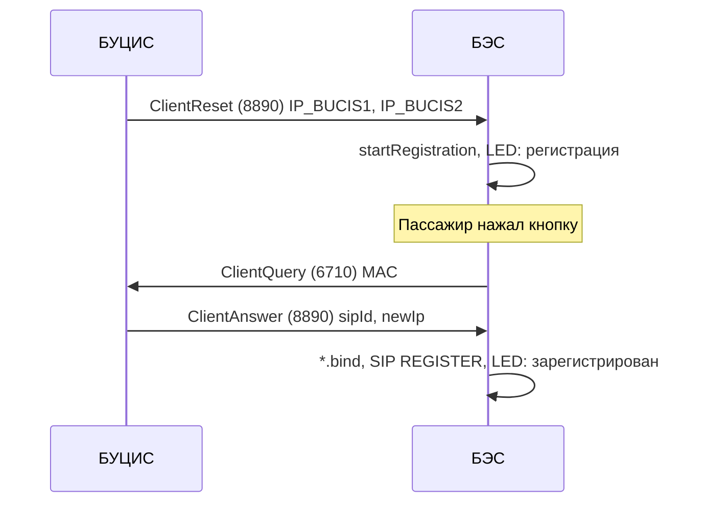
```mermaid
sequenceDiagram
    participant B as БУЦИС
    participant E as БЭС
    B->>E: ClientReset (8890) IP_BUCIS1, IP_BUCIS2
    E->>E: startRegistration, LED: регистрация
    Note over E: Пассажир нажал кнопку
    E->>B: ClientQuery (6710) MAC
    B->>E: ClientAnswer (8890) sipId, newIp
    E->>E: *.bind, SIP REGISTER, LED: зарегистрирован
```

**Смена активной головы (keepalive):**

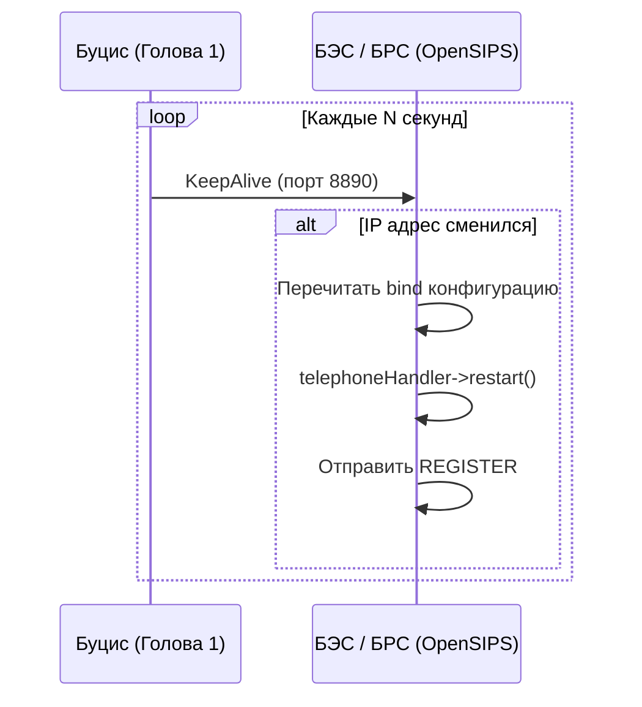
```mermaid
sequenceDiagram
    participant Буцис as Буцис (Голова 1)
    participant Бэс as БЭС / БРС (OpenSIPS)

    loop Каждые N секунд
        Буцис->>Бэс: KeepAlive (порт 8890)

        alt IP адрес сменился
            Бэс->>Бэс: Перечитать bind конфигурацию
            Бэс->>Бэс: telephoneHandler->restart()
            Бэс->>Бэс: Отправить REGISTER
        end
    end
```

**Резервирование при отказе БУЦИС (БРС):**

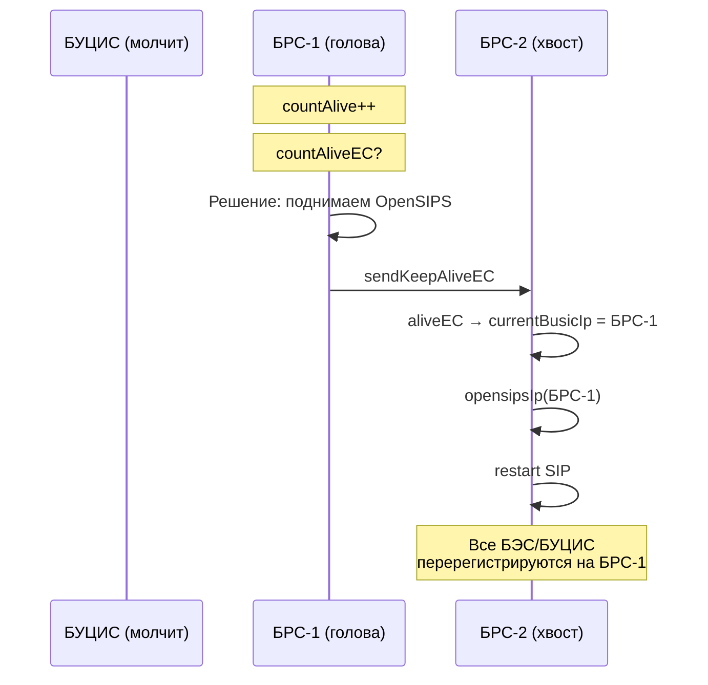
```mermaid
sequenceDiagram
    participant Буцис as БУЦИС (молчит)
    participant БРС1 as БРС-1 (голова)
    participant БРС2 as БРС-2 (хвост)

    Note over БРС1: countAlive++
    Note over БРС1: countAliveEC?

    БРС1->>БРС1: Решение: поднимаем OpenSIPS

    БРС1->>БРС2: sendKeepAliveEC

    БРС2->>БРС2: aliveEC → currentBusicIp = БРС-1
    БРС2->>БРС2: opensipsIp(БРС-1)
    БРС2->>БРС2: restart SIP

    Note over БРС2: Все БЭС/БУЦИС<br/>перерегистрируются на БРС-1
```

**Передача маршрута на БНТ:**

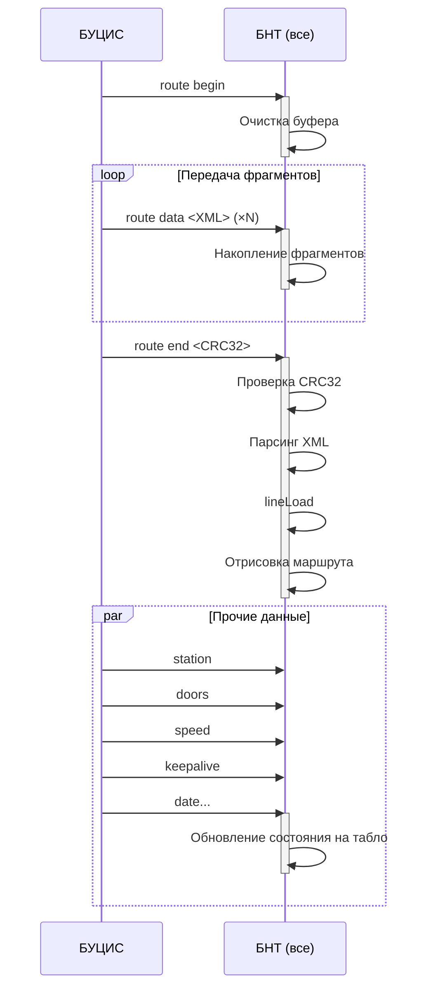
```mermaid
sequenceDiagram
    participant Буцис as БУЦИС
    participant БНТ as БНТ (все)

    Буцис->>БНТ: route begin
    activate БНТ
    БНТ->>БНТ: Очистка буфера
    deactivate БНТ

    loop Передача фрагментов
        Буцис->>БНТ: route data <XML> (×N)
        activate БНТ
        БНТ->>БНТ: Накопление фрагментов
        deactivate БНТ
    end

    Буцис->>БНТ: route end <CRC32>
    activate БНТ
    БНТ->>БНТ: Проверка CRC32
    БНТ->>БНТ: Парсинг XML
    БНТ->>БНТ: lineLoad
    БНТ->>БНТ: Отрисовка маршрута
    deactivate БНТ

    par Прочие данные
        Буцис->>БНТ: station
        Буцис->>БНТ: doors
        Буцис->>БНТ: speed
        Буцис->>БНТ: keepalive
        Буцис->>БНТ: date...
        activate БНТ
        БНТ->>БНТ: Обновление состояния на табло
        deactivate БНТ
    end
```

### Внутри блока (D-Bus)

На **БЭС** и **БРС** одновременно работают несколько Qt-процессов; обмен между ними — исключительно по **D-Bus (system bus)**. Архитектура одинакова для обоих блоков:

**БЭС** (сервисы на `BES28.*`):

| Направление             | Сигналы / методы                                                                                                                            |
| ----------------------- | ------------------------------------------------------------------------------------------------------------------------------------------- |
| UdpHandler → Manager    | `startRegistration`, `sipId`, `opensipsIp`, `stopTimer`, `play300/1000/3200`, `startTestBes`, `TestLedOn/Off/Blink`, `recordSig`, `stopSig` |
| ButtonHandler → Manager | `onClick` (нажатие кнопки)                                                                                                                  |
| Manager → UdpHandler    | `sendClientQuery`, методы отправки keepalive                                                                                                |
| Manager → LedHandler    | смена состояния → LED (ожидание, регистрация, разговор, очередь, громко и т.д.)                                                             |

Дополнительно в режиме **Busic** (флаг `isBusic = true`): Manager регистрирует сервис `BES28.BusicInformator` и пробрасывает SIP-события (входящий звонок, ответ, завершение, занято, очередь) во внешние подписчики. Тестовая утилита **BusicTester** подписывается на `BUSIC.Events` по D-Bus для верификации событий SIP при отладке.

**БРС** (сервисы на `BRS01.*`):

| Направление             | Сигналы / методы                                                                                       |
| ----------------------- | ------------------------------------------------------------------------------------------------------ |
| UdpHandler → Manager    | `alive`, `aliveEC`, `startTestBes`, `stopSig`, `recordSig`, `play300/1000/3200`, `TestLedOn/Blink/Off` |
| ButtonHandler → Manager | `clicked`, `clickedTD` (тангента)                                                                      |
| Manager → UdpHandler    | `sendKeepAlive`, `sendKeepAliveEC`, `onAnswer`, `onSoundStart`, `onSoundStop`                          |
| UdpHandler → Player     | `startTestBes`, тестовые команды                                                                       |

`onAnswer` отправляется Manager в UdpHandler при принятии входящего SIP-вызова; UdpHandler формирует и отправляет ответный UDP-пакет в сеть.

**Тестовый режим (порт 6666):** все блоки (БЭС, БРС, БНТ) слушают UDP-порт `6666`. При получении команды `test_start` / `"test"` выполняется переключение в тестовый сценарий — на БНТ это `systemctl start test`, на БЭС/БРС Manager завершается с кодом `100`, после чего внешний скрипт/супервизор запускает вместо него Player (Tester). Player завершается с кодом `101` для обратного переключения.

Таким образом, **взаимодействие между блоками** — по UDP по портам 6710, 8880, 8888, 8889, 8890, 8891, 8892/8881, 6666; внутри БЭС/БРС — по D-Bus (system bus); голос — дополнительно SIP 5060 и RTP 5003–5009.

---

## 8.3. Организация протоколов в системе

Протоколы разделены по **назначению** и **портам**. Транспорт — только **UDP** и **SIP/RTP** в одной подсети 192.168.5.0/24.

### Принципы организации

| Принцип                                 | Реализация                                                                                                                                     |
| --------------------------------------- | ---------------------------------------------------------------------------------------------------------------------------------------------- |
| **Один порт — один тип трафика**        | 8888 — маршрут/команды, 8889 — звук, 8890 — EC, 8891 — PGK keepalive. Приёмник по порту определяет парсер (CmdHandler, пакеты EC и т.д.).      |
| **Broadcast для общих данных**          | Маршрут и общие команды — на 192.168.5.255:8888; регистрация — с устройств на 8880; sound_start/stop — на 8889.                                |
| **Unicast для диалогов**                | ClientReset/ClientAnswer/KeepAlive — от БУЦИС к конкретному БЭС (или broadcast по реализации); ClientQuery — от БЭС к текущему БУЦИС:6710.     |
| **SIP только сигнализация**             | OpenSIPS не проксирует медиа; RTP идёт напрямую между абонентами (адреса из SDP).                                                              |
| **Резервирование без нового протокола** | Тот же UDP 8890/8891 и те же форматы пакетов; при смене активного узла меняется только IP источника OpenSIPS, клиенты переподключаются по SIP. |

### Сводная таблица «порт — протокол — участники»

| Порт      | Протокол      | Участники                   | Содержание                                                                                                                  |
| --------- | ------------- | --------------------------- | --------------------------------------------------------------------------------------------------------------------------- |
| 6666      | UDP           | Tester → все блоки          | Тест: переключение в тестовый режим (`test_start`); на БНТ — `systemctl start test`, на БЭС/БРС — exit(100) и запуск Player |
| 6710      | UDP           | БЭС→БУЦИС, хвост→БУЦИС      | ClientQuery; команды от хвоста/соседнего БУЦИС (**в Manager/proto.h порт 7777 — см. примечание**)                           |
| 8880      | UDP broadcast | Все ↔ БУЦИС                 | unit (регистрация устройств)                                                                                                |
| 8888      | UDP           | БУЦИС → все                 | Маршрут (route begin/data/end), station, doors, speed, keepalive, date, image_station; тест (БЭС/БРС)                       |
| 8889      | UDP broadcast | БУЦИС, БРС → БРС, приёмники | sound_start, sound_stop (синхронный звук)                                                                                   |
| 8890      | UDP           | БУЦИС ↔ БЭС, БУЦИС ↔ БРС    | ClientReset, ClientAnswer, KeepAlive, ClientConversation; ec_server_keepalive                                               |
| 8891      | UDP           | БУЦИС → БРС                 | keepalive (PGK)                                                                                                             |
| 8892/8881 | UDP           | Все                         | Метрики (приём/отправка)                                                                                                    |
| 5060      | SIP/UDP       | OpenSIPS, БУЦИС, БРС, БЭС   | REGISTER, INVITE, BYE, SDP                                                                                                  |
| 5003–5009 | RTP/UDP       | БУЦИС, БРС, БЭС             | Аудио G.726 (GStreamer)                                                                                                     |

В результате протоколы в системе организованы по портам и типам пакетов: управление и маршрут — 8888/8880, экстренная связь и регистрация БЭС — 8890/6710, синхронный звук — 8889, голос — SIP 5060 и RTP 5003–5009, диагностика — 8892/8881, тестирование — 6666.

---

## 9. Оператор ситуационного центра

**Оператор ситуационного центра (СЦ)** — внешний абонент голосовой связи, с которым обеспечивается экстренная и оперативная связь из состава.

- **Роль:** приём вызовов от пассажиров (через БЭС) и от машиниста/кабины, консультация, передача указаний, координация при инцидентах.
- **Доступ:** связь с оператором СЦ реализуется через ту же SIP-инфраструктуру поезда (OpenSIPS на БУЦИС или на БРС при резервировании). Вызов с БЭС первоначально устанавливается на машиниста; при необходимости машинист или система может переводить (переадресовать) разговор на абонента ситуационного центра.
- **Резервирование:** при отказе БУЦИС и переходе OpenSIPS на БРС возможность связи с оператором СЦ сохраняется — все SIP-клиенты (БЭС, кабина) перерегистрируются на новый узел, маршрутизация на внешнего абонента СЦ остаётся в рамках той же телефонии (шлюз или внешний SIP-сервер СЦ).

### 9.1. Схема связи с оператором СЦ

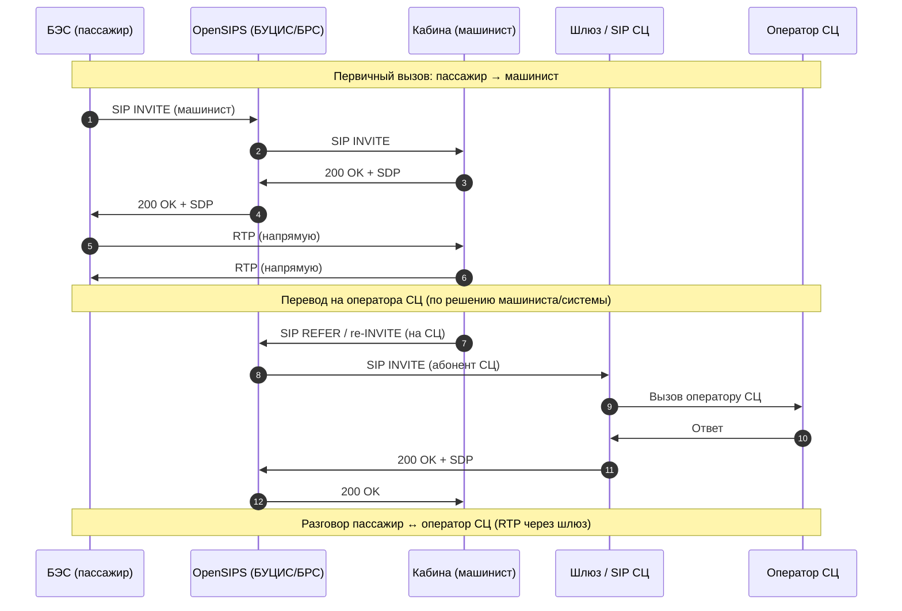
```mermaid
sequenceDiagram
    autonumber
    participant BES as БЭС (пассажир)
    participant OS as OpenSIPS (БУЦИС/БРС)
    participant Cab as Кабина (машинист)
    participant GW as Шлюз / SIP СЦ
    participant SC as Оператор СЦ

    Note over BES,SC: Первичный вызов: пассажир → машинист
    BES->>OS: SIP INVITE (машинист)
    OS->>Cab: SIP INVITE
    Cab->>OS: 200 OK + SDP
    OS->>BES: 200 OK + SDP
    BES->>Cab: RTP (напрямую)
    Cab->>BES: RTP (напрямую)

    Note over BES,SC: Перевод на оператора СЦ (по решению машиниста/системы)
    Cab->>OS: SIP REFER / re-INVITE (на СЦ)
    OS->>GW: SIP INVITE (абонент СЦ)
    GW->>SC: Вызов оператору СЦ
    SC->>GW: Ответ
    GW->>OS: 200 OK + SDP
    OS->>Cab: 200 OK
    Note over BES,SC: Разговор пассажир ↔ оператор СЦ (RTP через шлюз)
```

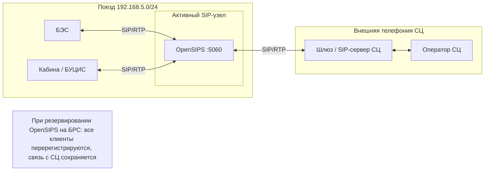
```mermaid
flowchart LR
    subgraph Поезд["Поезд 192.168.5.0/24"]
        BES[БЭС]
        Cab[Кабина / БУЦИС]
        subgraph SIP_Node["Активный SIP-узел"]
            OS[OpenSIPS :5060]
        end
    end

    subgraph Внешняя_сеть["Внешняя телефония СЦ"]
        GW[Шлюз / SIP-сервер СЦ]
        SC[Оператор СЦ]
    end

    BES <-->|SIP/RTP| OS
    Cab <-->|SIP/RTP| OS
    OS <-->|SIP/RTP| GW
    GW <--> SC

    note1[При резервировании OpenSIPS на БРС: все клиенты перерегистрируются, связь с СЦ сохраняется]
```

---

## 10. Описание протоколов

В системе «Сармат» поверх транспортного слоя (UDP) используются протоколы сигнализации и прикладные протоколы. Ниже приведено описание всех протоколов, кроме IP и UDP.

### 10.1. SIP (Session Initiation Protocol)

| Параметр       | Значение                                                  |
| -------------- | --------------------------------------------------------- |
| **Порт**       | 5060 (UDP)                                                |
| **Стандарт**   | RFC 3261                                                  |
| **Реализация** | OpenSIPS (сервер), Sofia-SIP (клиенты на БУЦИС, БРС, БЭС) |

**Назначение:** установка, изменение и завершение голосовых сессий (экстренная связь пассажир–машинист, межкабинная связь, связь с оператором СЦ).

**Основные методы:**

- **REGISTER** — регистрация абонента на OpenSIPS (один сервер в сети — на активном БУЦИС или на БРС при отказе).
- **INVITE** — инициация вызова (БЭС → машинист, кабина ↔ кабина).
- **200 OK** — принятие вызова, с телом SDP (адреса и порты для RTP).
- **ACK** — подтверждение установки сессии.
- **BYE** — завершение сессии.

**Особенности в системе:** OpenSIPS выполняет только сигнализацию; медиа-поток (RTP) передаётся напрямую между абонентами по адресам из SDP.

---

### 10.2. RTP (Real-time Transport Protocol)

| Параметр     | Значение                       |
| ------------ | ------------------------------ |
| **Порты**    | 5003–5009 (UDP)                |
| **Стандарт** | RFC 3550                       |
| **Кодек**    | G.726 (реализация — GStreamer) |

**Назначение:** передача аудиопотока в реальном времени при голосовых вызовах (экстренная связь, межкабинная связь).

**Особенности:** дуплексный поток между двумя абонентами; после обмена SDP в SIP каждый участник отправляет RTP-пакеты напрямую на IP:порт собеседника. OpenSIPS в медиа-путь не входит.

---

### 10.3. Протокол передачи маршрута (BNT)

**Транспорт:** UDP, порт 8888 (broadcast от БУЦИС).

**Назначение:** передача маршрута движения поезда в формате BNT XML на табло (БНТ).

**Формат сообщений (текстовые команды):**

- `route begin` — начало передачи маршрута.
- `route data <XML-фрагмент>` — фрагмент маршрута (линия, станции, пересадки).
- `route end <CRC32_hex>` — конец маршрута и контрольная сумма.

**Целостность:** получатель (БНТ) накапливает фрагменты, по `route end` вычисляет CRC32; при совпадении парсит XML и переключает отображение (`lineLoad`). При несовпадении — сброс буфера и повторная регистрация (`TryRegistration`).

#### 10.3.1. Формат BNT XML

Корневой элемент — `<line>` с атрибутами:

| Атрибут   | Значение                                            |
| --------- | --------------------------------------------------- |
| `name`    | Название линии; несколько названий разделяются `\|` |
| `isround` | `true` — кольцевая линия, `false` — радиальная      |

Вложенные элементы `<line>`:

- **`<icon>`** — иконка линии: символ и цвет (один или несколько элементов для составной иконки).
- **`<station>`** — станция маршрута (один элемент на станцию, в порядке следования).

Атрибуты `<station>`:

| Атрибут          | Значение                                    |
| ---------------- | ------------------------------------------- |
| `name`           | Название станции                            |
| `side`           | Сторона выхода: `left` / `right`            |
| `metro-transfer` | Признак пересадки на метро (`true`/`false`) |
| `cityexit`       | Выход в город: `left` / `right` / `both`    |
| `skip`           | Станция пропускается без остановки          |

Вложенные элементы `<station>`:

- **`<transfer>`** — пересадка: название, иконки (`<icon>`), атрибуты:
  - `isShow` — показывать ли пересадку на экране (`true`/`false`).
  - `crossPlatform` — пересадка осуществляется по одной платформе без выхода.
- **`<feature>`** — особенность станции: `ring-right`, `ring-left` (примыкание к кольцу), `river` (река), `closed` (закрыта) и др.

**Пример структуры:**

```xml
<line name="Сокольническая" isround="false">
  <icon symbol="1" color="#EF161E"/>
  <station name="Охотный Ряд" side="left" metro-transfer="true">
    <transfer name="Театральная" isShow="true">
      <icon symbol="2" color="#4FB04F"/>
    </transfer>
    <transfer name="Площадь Революции" isShow="true">
      <icon symbol="3" color="#0078BE"/>
    </transfer>
  </station>
  <station name="Библиотека им. Ленина" side="right" metro-transfer="true">
    <transfer name="Александровский сад" isShow="true">
      <icon symbol="4" color="#009EE0"/>
    </transfer>
  </station>
</line>
```

#### 10.3.2. Структуры данных после парсинга

| Структура                   | Поля                                                                                                                                                                              |
| --------------------------- | --------------------------------------------------------------------------------------------------------------------------------------------------------------------------------- |
| **Line**                    | Название, флаг кольцевой (`IsRound`), иконки линии (`Icon[]`), список станций (`Station[]`)                                                                                       |
| **Station / StationItem**   | Номер, название, сторона выхода (`side`), выход в город (`cityexit`), список пересадок (`Transfer[]`), признак метро-пересадки, признаки feature (кольцо, река, закрыта, пропуск) |
| **Transfer / TransferItem** | Название, иконки (`Icon[]`), `crossPlatform`, `isShow`                                                                                                                            |
| **Icon / IconPart**         | Символ и цвет                                                                                                                                                                     |

---

### 10.3.3. Протокол передачи PNG-изображений станций (image_station)

**Транспорт:** UDP, порт 8888 (broadcast от БУЦИС).

**Назначение:** передача PNG-изображений для отображения на табло (схемы выхода, иллюстрации станций).

**Формат команд** (аналогичен передаче маршрута):

- `image_station begin` — начало передачи, буфер очищается.
- `image_station data <фрагмент>` — накопление PNG-данных.
- `image_station end <CRC32_hex>` — конец; получатель проверяет CRC32.

**Целостность:** при совпадении CRC изображение передаётся в подсистему отображения (`bnt_image`). При несовпадении — буфер сбрасывается и отправляется перезапрос именно изображений (код `99`), без повторного запроса всего маршрута.

---

### 10.3.4. Оперативные сообщения (UDP 8089)

**Транспорт:** UDP, порт **8089** (только БНТ-29, отдельный от основного канала 8888).

**Назначение:** отображение срочных/информационных сообщений поверх схемы маршрута без прерывания основного потока команд.

**Формат пакета:** JSON-объект:

```json
{ "text": "<текст сообщения>", "time": <секунды> }
```

- `text` — текст сообщения (поддерживается HTML-разметка).
- `time` — продолжительность отображения в секундах; по истечении сообщение снимается.

**Обработка:** `OpsRendering::OnMessage()` принимает пакет и рисует сообщение в `paintOverGL()` поверх слоя маршрута (`RouteRendering`). Тип сообщения (срочное / информационное / рекламное / аварийное) задаётся значением `MsgType` внутри рендерера.

**Аварийные сообщения в BNT XML:** помимо UDP 8089, экстренное сообщение может быть передано как элемент `<emergency_message>` внутри самого BNT XML-маршрута — в этом случае оно отображается как часть маршрутного рендера и не требует отдельного UDP-пакета.

---

### 10.4. Протокол регистрации устройств (unit)

**Транспорт:** UDP, порт 8880 (broadcast от устройств к БУЦИС).

**Назначение:** регистрация блоков (БНТ, БЭС и др.) в составе и получение от БУЦИС маршрута и команд.

**Формат:** текстовая строка вида  
`unit <тип> <MAC-suffix> <IP> <версия>`  
на broadcast-адрес 192.168.5.255:8880. БУЦИС по этим данным ведёт учёт устройств и рассылает им маршрут (8888) и управляющие команды.

---

### 10.5. Протокол экстренной связи (EC)

**Транспорт:** UDP, порты 8890 (основной обмен), 6710 / 7777 (запрос от БЭС к БУЦИС).

**Назначение:** регистрация блоков БЭС в составе, выдача им SIP-параметров (sipId, newIp), heartbeat, учёт состояния разговора.

**Типы пакетов (бинарные/структурированные, форматы в UdpHandler/БУЦИС):**

- **ClientReset** (БУЦИС → БЭС, 8890) — начало регистрации; содержит `ip_first` (192.168.5.251) и `ip_second` (192.168.5.252), чтобы БЭС знал оба адреса для резервирования.
- **ClientQuery** (БЭС → БУЦИС) — запрос регистрации; содержит MAC-адрес блока и факт нажатия кнопки пользователем. **Порт назначения: существует рассогласование между модулями** — в `Manager/proto.h` задан `PORT_LISTEN_BUCIS = 7777`, тогда как в `UdpHandler/proto.h` используется порт `6710`. При развёртывании необходимо убедиться, что значение согласовано между кодом БУЦИС и кодом БЭС.
- **ClientAnswer** (БУЦИС → БЭС, 8890) — ответ: `sipId` (идентификатор абонента) и `newIp` (IP для создания bind-файлов и выполнения SIP REGISTER).
- **KeepAlive** (БУЦИС → БЭС, 8890) — периодическая отправка IP **текущего активного** OpenSIPS; при смене IP БЭС немедленно перечитывает bind-файл и перезапускает SIP — это основной механизм переключения при отказе головы.
- **ClientConversation** (БУЦИС → БЭС, 8890) — несёт `sipId`; по нему БЭС останавливает таймер ожидания ответа и фиксирует факт разговора.

На порту 8890 также обмен между БУЦИС и БРС: ec_server_keepalive, keepalive для определения активной головы и резервирования.

---

### 10.6. Протокол синхронного звука (UDP 8889)

**Транспорт:** UDP, порт 8889 (broadcast).

**Назначение:** единое включение/выключение звука на всех блоках (БРС, при необходимости БНТ) — объявления по маршруту, громкая связь по составу.

**Команды (текстовые):**

- `sound_start <тип>;<timestamp_ms>;` — тип: 1 — файл, 2 — микрофон (громкая связь) и т.д.; таймштамп для синхронного старта воспроизведения.
- `sound_stop` — остановка воспроизведения на всех приёмниках.

Инициатор: БУЦИС или БРС (при тангенте). Приёмники запускают локальный GStreamer (RTP или файл) по `sound_start` и останавливают по `sound_stop`.

---

### 10.7. Протокол heartbeat / keepalive между головами

**Транспорт:** UDP, порт 6710 (между БУЦИС голов), порт 8891 (БУЦИС → БРС, PGK keepalive).

**Назначение:** обмен «живости» между головными блоками; по отсутствию heartbeat резервная голова (БРС) принимает решение о подъёме OpenSIPS и переключении управления.

**Формат:** определяется внутренним протоколом 775 (keepalive, unit, sys_info и др.); разбор в CmdHandler775 на БУЦИС.

---

### 10.8. Протокол метрик

**Транспорт:** UDP, порты 8892 (приём метрик сборщиком), 8881 (управление/ответы).

**Назначение:** сбор и выдача диагностических данных с блоков (БУЦИС, БНТ, БЭС, БРС) для мониторинга и отладки.

**Триггер:** блок отвечает строкой метрик при получении команды `get_metrics` на порт 8892.

**Формат ответной строки:**

```
metrics <тип_блока>;<ip>;<Heartbit>;<Температура>;;;;
```

Поля разделены точкой с запятой; хвостовые `;;;;` зарезервированы для расширения. `Heartbit` — счётчик живости (инкрементируется периодически), `Температура` — температура процессора. Формирование строки реализовано в классе `MetricMaker` (присутствует в БНТ, БМТ/БВИТ).

---

### 10.9. Текстовые команды управления (порт 8888)

Помимо маршрута (route begin/data/end), по UDP 8888 от БУЦИС рассылаются команды состояния и управления:

| Команда                        | Аргументы                                     | Назначение                                                                                                                                                            |
| ------------------------------ | --------------------------------------------- | --------------------------------------------------------------------------------------------------------------------------------------------------------------------- |
| `station`                      | `num state`                                   | Текущая станция (0 — прибытие, 1 — отправление)                                                                                                                       |
| `doors`                        | `state_l state_r`                             | Состояние дверей                                                                                                                                                      |
| `speed`                        | `value`                                       | Скорость (км/ч)                                                                                                                                                       |
| `temperature`                  | `value`                                       | Температура в салоне                                                                                                                                                  |
| `keepalive`                    | `IP;speed;date;temp;timeStation;Compositions` | Периодический heartbeat (например, каждые 2 с): IP головного устройства, скорость, дата, температура, время до ближайшей станции (одно значение), количество составов |
| `date`                         | `MMddhhmmyyyy.ss`                             | Синхронизация времени                                                                                                                                                 |
| `sys_time_stn`                 | `t1;t2;...` (до 10 значений)                  | Полный массив времени до станций (с); детализация относительно одного значения из `keepalive`                                                                         |
| `image_station begin/data/end` | CRC32                                         | Передача PNG-изображений станций для БНТ                                                                                                                              |
| `reg_data_request`             | —                                             | Запрос данных устройства                                                                                                                                              |
| `reset`                        | —                                             | Сброс, повторная регистрация (БНТ)                                                                                                                                    |
| `work_from_battery`            | `0\|1`                                        | Управление PWM/яркостью (БНТ)                                                                                                                                         |

---

### 10.10. Bind-файлы SIP

Bind-файлы — INI-файлы с учётными данными SIP для конкретного направления связи. Используются на всех устройствах с SIP-стеком: БЭС, БРС, БУЦИС.

**Расположение:** `/opt/sarmat/`, по одному файлу на каждое направление (текущий БУЦИС, резервный БУЦИС, БРС 201, БРС 202). Активный файл выбирается по IP из `KeepAlive`-пакета.

**Формат** (секция `[SIP]`):

| Поле                                 | Содержимое                                                     |
| ------------------------------------ | -------------------------------------------------------------- |
| `DOMAIN`                             | IP OpenSIPS (активная голова: 192.168.5.251 или 192.168.5.252) |
| `USER`                               | SIP-логин блока (например, номер устройства)                   |
| `URI`                                | SIP URI абонента (`sip:user@domain`)                           |
| `DEST_IP`                            | IP назначения при звонке                                       |
| `DEST`                               | SIP URI назначения                                             |
| `PROXY`                              | IP прокси (совпадает с `DOMAIN`)                               |
| `PORT_SIP`                           | Порт SIP-сигнализации (5060)                                   |
| `PORT_RTP` / `portDRtp` / `portSRtp` | Порты RTP приёма и передачи (например, 5003–5009)              |
| `PORT_REC1` / `PORT_REC2`            | Порты записи разговора                                         |

**Жизненный цикл:**

1. При первичной регистрации БЭС получает `ClientAnswer` с `sipId` и `newIp` → `SettingsService` создаёт (или перезаписывает) bind-файл для данного направления.
2. При получении `KeepAlive` с изменившимся IP OpenSIPS `SettingsService` перевыбирает актуальный bind-файл → перезапускает SIP-клиент (`TelephoneHandler::restart()`).
3. `FileWatcher` отслеживает изменения bind-файлов на диске и автоматически применяет их без перезапуска приложения.

Таким образом, bind-файлы являются единым механизмом резервирования SIP для всех блоков системы: смена активной головы происходит прозрачно через обновление `DOMAIN` в bind-файле по сигналу `KeepAlive`.
