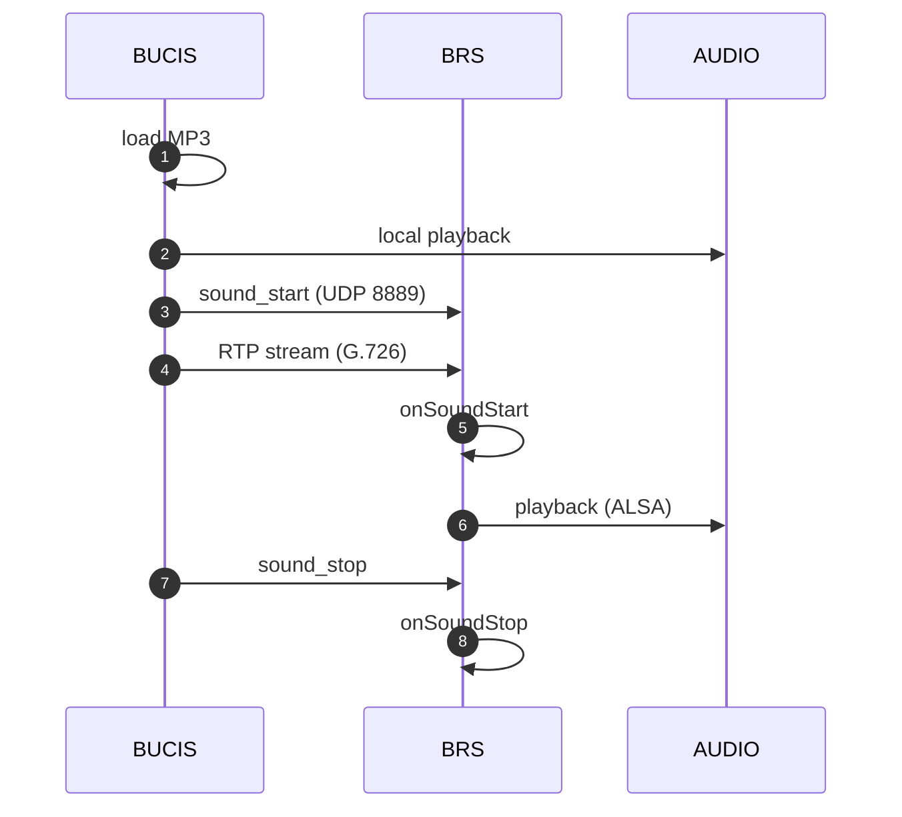
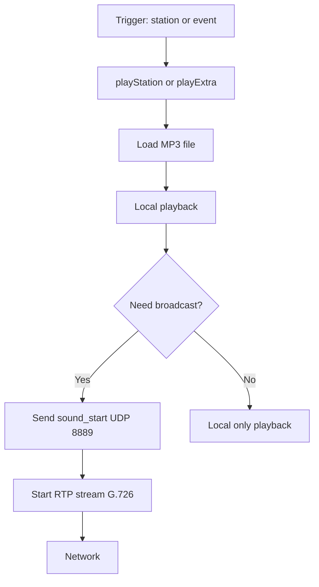

# Полный путь воспроизведения объявления по станции

## 0. Тип сценария

Это file-based сценарий воспроизведения:

- Контент: MP3 / WAV (file-based)
- Триггер: смена станции или действие машиниста
- Синхронизация: UDP broadcast (порт 8889)
- Транспорт: RTP (кодек G.726) — при трансляции по составу
- Воспроизведение: QMediaPlayer / GStreamer + ALSA

---

## 1. Источник контента (БУЦИС, filesystem)

### Расположение файлов

```
routes/<line>/<route>/MP3/<station_name>.mp3
routes/<line>/<route>/MP3/<extra_content>.mp3
```

Пути к каталогам задаются в `bucis-12.ini`:

```ini
[route]
linedir  = routes/L1
routedir = routes/R1
```

### Характеристики

- статические аудиофайлы (MP3 или WAV)
- входят в состав маршрутного пакета
- загружаются при инициализации маршрута (`loadRoute()`)
- один файл соответствует одной станции или одному дополнительному контенту

### Структура маршрутного каталога

```
routes/
└── L1/               ← линия
    └── R1/           ← маршрут
        ├── MP3/      ← аудиофайлы объявлений
        ├── BNT/      ← BNT XML маршрута (для табло)
        └── PNG/      ← изображения станций
```

### Логическое сопоставление

```
event: STATION_ARRIVAL   → file: <station_name>_arrival.mp3
event: STATION_DEPARTURE → file: <station_name>_departure.mp3
event: EXTRA_CONTENT     → file: <extra_name>.mp3
```

---

## 2. Инициализация маршрута

### Последовательность загрузки

```cpp
loadRoute()      // загрузка маршрута, подготовка списка файлов
initRoute()      // инициализация плеера, привязка к маршруту
readStations()   // чтение списка станций из конфигурации
readExtras()     // чтение дополнительного контента
```

### Что происходит при `loadRoute()`

1. Читается конфигурация маршрута (`config.ini` в каталоге маршрута).
2. Строятся пути к MP3-файлам по каждой станции.
3. Плеер (`QMediaPlayer` или GStreamer) подготавливается к воспроизведению.
4. Маршрут рассылается на табло (БНТ) по UDP 8888 (`route begin / data / end`).

---

## 3. Триггер события (control layer)

### Источники триггера

1. **Автоматический** — команда `station` от системы (смена станции по расписанию или координатам).
2. **Ручной** — нажатие кнопки F1–F4 на пульте машиниста (`OSSerial`, `/dev/ttymxc4`).
3. **Сценарный** — логика маршрута (подход к станции, отправление, транзитный проезд).

### Команда `station` по UDP 8888

БУЦИС получает (или сам генерирует) команду:

```
station <num> <state>
```

- `num` — номер станции в маршруте (0-based).
- `state` — `0` = прибытие, `1` = отправление.

### Вызовы в коде

```cpp
playStation()   // объявление при смене станции
playExtra()     // дополнительный контент (реклама, информация)
```

---

## 4. Локальное воспроизведение (БУЦИС, кабина)

### Вариант A — QMediaPlayer (Qt Multimedia)

```
MP3/WAV file → QMediaPlayer → decode → ALSA → динамик кабины
```

Используется для стандартного воспроизведения объявлений по маршруту.

### Вариант B — GStreamer pipeline

```
filesrc → decodebin → alsasink
```

Pipeline задаётся в `bucis-12.ini`, секция `[gst-pipeline]`:

```ini
[gst-pipeline]
head2play = filesrc location=%1 ! decodebin ! alsasink device=hw:0
```

Это воспроизведение только в кабине (локально). Для трансляции по составу требуется дополнительный шаг (см. раздел 5).

---

## 5. Решение о трансляции по составу

```cpp
if (needBroadcast) {
    sendSoundStart(type=1, timestamp=now_ms)
    startRtpStream()
}
```

### Условия трансляции

- объявление должно быть слышно во всех вагонах (пассажирское оповещение).
- система в штатном режиме.
- флаг трансляции задаётся в конфигурации маршрута или логике `OSMainWindow`.

---

## 6. Синхронизация (UDP 8889)

### Команда

```
sound_start 1;<timestamp_ms>;
```

### Параметры

- `1` — тип: воспроизведение файла (file-based).
- `timestamp_ms` — абсолютный момент запуска для синхронизации приёмников.

### Адрес

```
192.168.5.255:8889  (broadcast)
```

БУЦИС рассылает команду на все блоки в подсети одновременно с локальным стартом воспроизведения.

---

## 7. Обработка на БРС

### Поток обработки

```
UDP 8889 → UdpHandler → парсинг SoundCmd → D-Bus → Manager
```

### Цепочка вызовов

1. UdpHandler принимает пакет на порт 8889.
2. Парсирует как `SoundCmd` (`sound_start 1;<timestamp_ms>;`).
3. Эмитирует D-Bus сигнал:

```
onSoundStart(type=1, timestamp_ms)
```

4. Manager получает сигнал и запускает нужный GStreamer pipeline.

---

## 8. Передача аудио (RTP, G.726)

### Pipeline на БУЦИС (TX)

```
filesrc
 → decodebin
 → avenc_g726      ← кодирование в G.726
 → rtpg726pay      ← упаковка в RTP
 → udpsink         ← отправка в сеть
```

Pipeline задаётся в секции `[gst-pipeline]` файла `bucis-12.ini` (ключ `mic2net` или аналогичный).

### Особенности

- RTP передаётся напрямую в подсеть (broadcast или unicast по IP).
- SIP-сигнализация в этом сценарии **не участвует** — только RTP.
- Адрес и порт назначения задаются в `pipeLinePlay` (Utils).

---

## 9. Приём RTP на БРС

### Pipeline (RX)

```
udpsrc             ← приём RTP пакетов
 → rtpg726depay    ← распаковка из RTP
 → avdec_g726      ← декодирование G.726
 → alsasink        ← воспроизведение на динамике вагона
```

Pipeline задаётся в `/opt/sarmat/settings.ini`, секция `[GSTREAMER]`.

### Важно

- Pipeline запускается по сигналу `onSoundStart` от UdpHandler через D-Bus.
- Синхронизация старта — по параметру `timestamp_ms` из команды `sound_start`.

---

## 10. Синхронный запуск

```
start_time = timestamp_ms
// каждый приёмник стартует в один момент времени
```

- Все устройства получают одинаковый `timestamp_ms`.
- Каждый приёмник запускает pipeline не раньше `start_time`.
- Рассинхронизация компенсируется буферизацией GStreamer.

---

## 11. Воспроизведение

```
G.726 decode → alsasink → динамики вагона
```

Результат:

- синхронное воспроизведение объявления во всех вагонах.
- одновременно с воспроизведением в кабине машиниста (локально).

---

## 12. Завершение

### Команда

```
sound_stop
```

### Реакция на БРС

```
onSoundStop() → Manager → stop GStreamer pipeline
```

### Условие отправки БУЦИС

- завершение воспроизведения файла (`QMediaPlayer::mediaStatusChanged` → `EndOfMedia`).
- ручная остановка машинистом.

---

## 13. Схема взаимодействия



---

## 14. Внутренняя цепочка БУЦИС (детально)



---

## 15. Дополнительный контент (playExtra)

Помимо объявлений по станциям, БУЦИС воспроизводит **дополнительный контент** (рекламные, информационные ролики):

- Файлы хранятся в том же каталоге `MP3/` маршрута.
- Метаданные (порядок, время воспроизведения) задаются в `config.ini` маршрута.
- Метод `playExtra()` вызывается по таймеру или между объявлениями станций.
- Трансляция по составу — аналогично: `sound_start 1;<ts>;` → RTP → `sound_stop`.

---

## 16. Архитектурные свойства

- **Разделение control и media** — команда `sound_start/stop` (control) отделена от RTP-потока (media).
- **Слабая связность** — приёмники (БРС) не знают о содержимом файла; они только запускают pipeline по команде.
- **Stateless-приёмники** — БРС не хранит состояние маршрута; решение о воспроизведении принимает только БУЦИС.
- **Синхронизация по timestamp** — компенсирует сетевые задержки при доставке UDP-команды.
- **Двойной путь** — локальное воспроизведение в кабине и трансляция по составу идут параллельно.

---

## 17. Потенциальные проблемы

1. **Рассинхронизация времени** — если системные часы БУЦИС и БРС расходятся, `timestamp_ms` не даёт точного выравнивания.
2. **Потеря UDP-пакетов** — `sound_start` или `sound_stop` может не дойти до отдельных блоков (нет подтверждения доставки).
3. **Отсутствие файла** — если MP3 для станции не найден в каталоге маршрута, воспроизведение пропускается без трансляции.
4. **Несинхронный старт RTP** — RTP-пакеты могут прийти на БРС раньше, чем команда `sound_start`, или позже; буферизация GStreamer компенсирует небольшой разброс.
5. **Повторный запуск** — двойной `sound_start` без `sound_stop` может привести к дублированию pipeline.
6. **Смена маршрута на ходу** — при `loadRoute()` во время воспроизведения необходима принудительная остановка текущего pipeline.

---

## 18. Краткое резюме

- MP3 / WAV — источник звука (каталог маршрута на БУЦИС)
- `playStation()` / `playExtra()` — методы запуска воспроизведения
- QMediaPlayer или GStreamer — локальное воспроизведение в кабине
- UDP 8889 — синхронизация старта/стопа по составу
- RTP / G.726 — транспорт аудио на БРС
- GStreamer (`udpsrc → avdec_g726 → alsasink`) — воспроизведение на динамиках вагона
